# Day 1 : Unix Command Line & Git & Git Hub Dasar

## Unix Command Line

- Shell adalah sebuah program yang menerima perintah (Command) untuk di eksekusi oleh system.
- Command Line Interface (CLI) atau Antarmuka Baris Perintah berfungsi untuk memasukkan perintah (Command) pada Sistem.
- Terminal Emulator Program atau Aplikasi untuk mengakses CLI, contoh Terminal Emulator di windows adalah Command Prompt (CMD) , Terminal, dan Windows PowerShell.

<b>Mengakses CLI pada Windows.</b>

Untuk mengakses CLI pada Windows bisa menggunakan Git Bash, CMD, PowerShell atau Terminal. Untuk Git Bash diharuskan mendownload dan menginstall terlebih dahulu, tetapi untuk CMD, PowerShell dan Terminal sudah ada dari Windows.

<b>File System Structure</b>

File System Structure berfungsi untuk mengatur data yang disimpan didalam sebuah system.

<b>Command pada CLI</b>

- pwd (Print working directory). Command untuk melihat current working directory.
  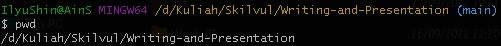
- ls (lists). Command untuk melihat isi file yang ada di sebuah direktori.
  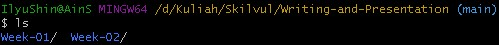
- cd (change directory). Command untuk berpindah direktori.  
  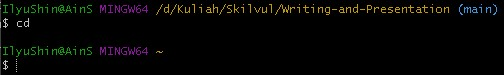
- cat (concatenate). Command untuk melihat seluruh isi sebuah file.
  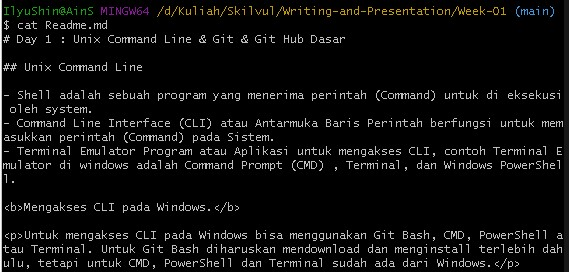
- head. Command untuk melihat beberapa line awal dari sebuah file.
  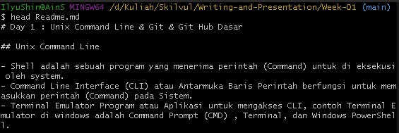
- tail. Command untuk melihat beberapa line akhir dari sebuah file.
  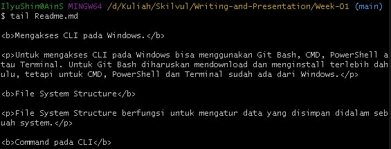
- touch. Command untuk membuat sebuah file.
  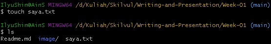
- mkdir (make directory). Command untuk membuat sebuah direktori
  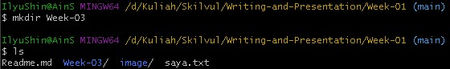
- cp (copy). Command untuk mengcopy (menyalin) file.
  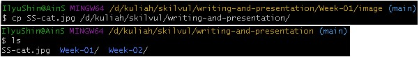
- cp -r (recursive copy). Command untuk mengcopy (menyalin) directory.
  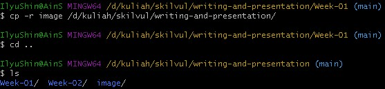
- mv (move). Command untuk memindahkan file dan direktori.
  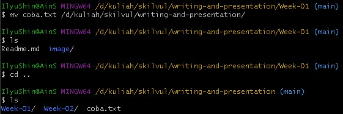
- mv (rename). Command mv juga bisa untuk mengganti nama file atau direktori.
  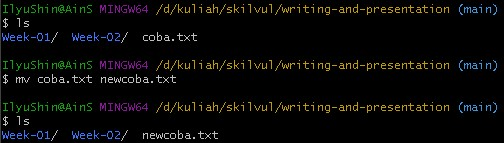
- rm (remove). Command untuk menghapus file.
  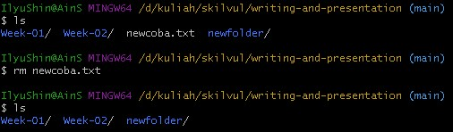
- rm -r (recursive remove). Command untuk menghapus direktori.
  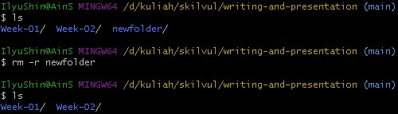

## Git & GitHub Dasar
