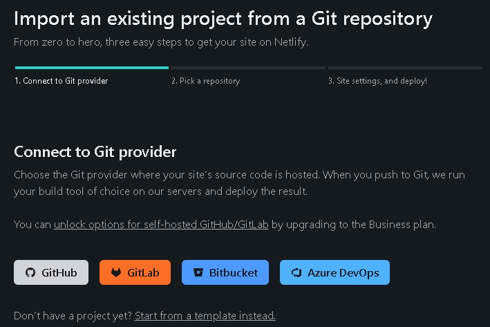

# Day 1 : Unix Command Line & Git & Git Hub Dasar

## Unix Command Line

- Shell adalah sebuah program yang menerima perintah (Command) untuk di eksekusi oleh system.
- Command Line Interface (CLI) atau Antarmuka Baris Perintah berfungsi untuk memasukkan perintah (Command) pada Sistem.
- Terminal Emulator Program atau Aplikasi untuk mengakses CLI, contoh Terminal Emulator di windows adalah Command Prompt (CMD) , Terminal, dan Windows PowerShell.

<b>Mengakses CLI pada Windows.</b>

<p>Untuk mengakses CLI pada Windows bisa menggunakan Git Bash, CMD, PowerShell atau Terminal. Untuk Git Bash diharuskan mendownload dan menginstall terlebih dahulu, tetapi untuk CMD, PowerShell dan Terminal sudah ada dari Windows.</p>

<b>File System Structure</b>

<p>File System Structure berfungsi untuk mengatur data yang disimpan didalam sebuah system.</p>

<b>Command pada CLI</b>

- pwd (Print working directory). Command untuk melihat current working directory. <br/>
  
- ls (lists). Command untuk melihat isi file yang ada di sebuah direktori. <br/>
  
- cd (change directory). Command untuk berpindah direktori. <br/>
  
- cat (concatenate). Command untuk melihat seluruh isi sebuah file. <br/>
  
- head. Command untuk melihat beberapa line awal dari sebuah file.
  
- tail. Command untuk melihat beberapa line akhir dari sebuah file.
  
- touch. Command untuk membuat sebuah file. <br/>
  
- mkdir (make directory). Command untuk membuat sebuah direktori
  
- cp (copy). Command untuk mengcopy (menyalin) file. <br/>
  
- cp -r (recursive copy). Command untuk mengcopy (menyalin) directory.
  
- mv (move). Command untuk memindahkan file dan direktori.
  
- mv (rename). Command mv juga bisa untuk mengganti nama file atau direktori.
  
- rm (remove). Command untuk menghapus file. <br/>
  
- rm -r (recursive remove). Command untuk menghapus direktori. <br/>
  

## Git & GitHub Dasar

<b>Apa itu Git & GitHub? Kenapa Git & GitHub menjadi tool yang wajib digunakan?</b>

<p><b>Git</b> adalah adalah aplikasi yang dapat melacak setiap perubahan yang terjadi pada suatu folder atau file. <br/> <b>GitHub</b> adalah tempat atau platform untuk menyimpan source code suatu proyek dan melacak riwayat lengkap semua perubahan. Dan GitHub sebagai tempat berkaloborasi projects dalam sebuah team yang sama tanpa harus copy paste folder.</p>

<b>Perbedaan antara Git dan GitHub</b>

<p><b>Git</b> merupakan software berbasis Version Control System (VCS) yang bertugas untuk mencatat perubahan seluruh file atau repository suatu project. Sedangkan <b>GitHub</b> merupakan layanan cloud yang berguna untuk menyimpan dan mengelola sebuah project yang dinamakan repository (repo git).</p>

<b>Alur kerja Git dan GitHub</b>

<p><b>Git</b> sebagai Version Control System berguna untuk mencatat setiap perubahan dalam seluruh file atau respository, sedangkan <b>GitHub</b> tempat upload project yang telah dibuat secara local.</p>

<b>Membuat Repository pada GitHub</b>

- Buka Website GitHub dan Login.
- klik tab Repositories dan klik New.
  
- Masukkan nama untuk repository nya dan pilih Public bila ingin dilihat oleh orang lain. Jika tidak ingin dilihat orang lain, pilih Private
  
- centang Add a README File bila ingin langsung membuat file Readme didalam repository dan Create repository.
  

<b>Command atau Perintah pada Git</b>

- git add. Command yang digunakan untuk menambahkan file baru di repository yang dipilih.
  
- git commit. Command untuk menyimpan perubahan yang sudah dilakukan, namun tidak ada perubahan yang terjadi pada remote repository.
  
- git push. Command untuk mengirimkan perubahan file yang dilakukan setelah di commit ke remote repository.
  
- git clone. Command membuat Salinan repository lokal. <br/>
   <br/><br/>

# Day 2 : HTML

<b>Pengenalan HTML</b>

<p>HTML adalah singkatan dari Hypertext Markup Language. HTML digunakan untuk menampilkan konten pada browser. Contoh konten yang dapat ditampilkan seperti Text, Image, Video, Link, dan masih banyak lainnya. Dan HTML bukan sebuah bahasa pemrograman (programming languange), melainkan sebuah markup languange. Karna HTML bukan sebuah bahasa pemrograman HTML tidak bisa dinamis mengelola data karna itu HTML bersifat static, yang hanya menampilkan konten saja.</p>

<b>Tool Pendukung untuk membuat HTML</b>

1. Browser (Chrome, Mozila, Opera, Microsoft Edge dan lain - lain).
1. Code Editor (Visual Studio Code, Sublime Text, Lapce dan lain - lain).
1. Ekstensi Khusus untuk Visual Studio Code (Prettier, Live Server, Auto Rename Tag, Auto Close Tag dan lain - lain).

<b>Membuat HTML / Website Sederhana</b>

```html
<!DOCTYPE html>
<html lang="en">
  <head>
    <meta charset="UTF-8" />
    <meta http-equiv="X-UA-Compatible" content="IE=edge" />
    <meta name="viewport" content="width=device-width, initial-scale=1.0" />
    <title>WebsiteKu</title>
  </head>
  <body>
    <h1>Hallo World!</h1>
    <p>Nama Saya Muhammad Sadewo Wicaksono</p>
  </body>
</html>
```


<b>Cara menjalankan HTML di Browser</b>

<p>Terdapat 2 cara dalam menjalankan HTML, yaitu secara manual dengan memasukkan direktori file pada search bar browser dan dengan ekstensi live server yang ada di Visual Studio Code.</p>

- Menjalankan secara manual. <br/>
   <br/>
  Penjelasan : Pada Search bar kita masukkan lokasi / tempat file html berada.
- Menjalankan dengan Live Server <br/>
   <br/>
  Note : Diharuskan menginstall ekstension live server terlebih dahulu
   <br/>
  Hasil nya sama seperti manual, tetapi tanpa harus mengetikkan lokasi file berada.

<b>Tag Populer dalam HTML</b>

- img (image). Tag tersebut berguna untuk menyisipkan gambar pada HTML.

```html
 
```


- p (paragraph). Tag tersebut berguna untuk membuat paragraf pada HTML.

```html
<p>Nama Saya Muhammad Sadewo Wicaksono</p>
<p>Saya sedang Stupen di SKilvul</p>
```


- a (a href). Tag tersebut berguna untuk membuat tulisan menjadi tulisan berlink.

```html
<a href="https://www.google.com/">google</a> ``
```


<b>semantic HTML</b>

<p>Apa itu Semantic HTML? Semantic HTML adalah Tag HTML yang memiliki arti atau makna. <br/>
Contoh Semantic HTML</p>


<p>Pada Semantic HTML kita tidak perlu lagi footer dibuat di dalam div class.</p>


<p>Karna footer terdapat Tag nya sendiri yang mempermudah dalam pembuatan Website.</p>

<b>Mendeploy Website ke Netlify</b>

1. Buka Website Netlify https://app.netlify.com/
2. Login menggunakan GitHub. <br/>
   
3. Klik tab Sites dan klik Import from Git.
   
4. Pilih GitHub. <br/>
   
5. Pilih Repository dari GitHub yang ingin di Deploy.
   
6. Pada bagian Site Setting bisa di Skip / Scroll saja dan Klik Deploy Site.
   
   
7. Website sudah di Deploy, selanjutnya tinggal klik Link tersebut dan membuat Website yang sudah di Deploy.
   
8. Website sudah bisa dibuka secara Online. https://celebrated-paletas-a17b4a.netlify.app/
   

# Day 3 : CSS

<b>Apa itu CSS dan apa Peran CSS dalam HTML ?</b>

<p>CSS (Cascading Style Sheets) adalah bahasa yang digunakan untuk mendesain halaman website. Seperti pengertiannya, CSS memiliki Peran sebagai mendesain halaman Website menjadi lebih menarik.</p>

<b>Menyisipkan CSS kedalam HTML</b>

<p>Terdapat 3 cara dalam menyisipkan CSS kedalam HTML</p>

1. Internal CSS. CSS dimasukkan langusng di dalam HTML menggunakan tag < style >.

```html
<!DOCTYPE html>
<html lang="en">
  <head>
    <meta charset="UTF-8" />
    <meta http-equiv="X-UA-Compatible" content="IE=edge" />
    <meta name="viewport" content="width=device-width, initial-scale=1.0" />
    <title>WebsiteKu</title>
    <style>
      p {
        color: blue;
      }
    </style>
  </head>
  <body>
    <h1>Hallo World!</h1>
    <p>Nama Saya Muhammad Sadewo Wicaksono</p>
    <a href="https://www.google.com/">google</a>
    <p>Saya sedang Stupen di SKilvul</p>
    
    
  </body>
</html>
```


2. Eksternal CSS. CSS terpisah dengan html, dan mengharuskan membuat file dengan ekstensi .css.

```html
<!DOCTYPE html>
<html lang="en">
  <head>
    <meta charset="UTF-8" />
    <meta http-equiv="X-UA-Compatible" content="IE=edge" />
    <meta name="viewport" content="width=device-width, initial-scale=1.0" />
    <link rel="stylesheet" href="style.css" />
    <title>WebsiteKu</title>
    <style>
      p {
        color: blue;
      }
    </style>
  </head>
  <body>
    <h1>Hallo World!</h1>
    <p>Nama Saya Muhammad Sadewo Wicaksono</p>
    <a href="https://www.google.com/">google</a>
    <p>Saya sedang Stupen di SKilvul</p>
    
    
  </body>
</html>
```


3. Inline CSS. CSS langsung disematkan kedalam element HTML.

```html
<!DOCTYPE html>
<html lang="en">
  <head>
    <meta charset="UTF-8" />
    <meta http-equiv="X-UA-Compatible" content="IE=edge" />
    <meta name="viewport" content="width=device-width, initial-scale=1.0" />
    <link rel="stylesheet" href="style.css" />
    <title>WebsiteKu</title>
    <style>
      p {
        color: blue;
      }
    </style>
  </head>
  <body>
    <h1>Hallo World!</h1>
    <p>Nama Saya Muhammad Sadewo Wicaksono</p>
    <p style="color: red">inline css</p>
    <a href="https://www.google.com/">google</a>
    <p>Saya sedang Stupen di SKilvul</p>
    
    
  </body>
</html>
```


<b>Tag dasar dan styling pada CSS</b>

1. < link >. Tag link berguna untuk menghubungkan file CSS dengan file HTML.

```html
<!DOCTYPE html>
<html lang="en">
  <head>
    <meta charset="UTF-8" />
    <meta http-equiv="X-UA-Compatible" content="IE=edge" />
    <meta name="viewport" content="width=device-width, initial-scale=1.0" />
    <link rel="stylesheet" href="style.css" />
    <title>Document</title>
  </head>
  <body></body>
</html>
```

2. < style >. Tag style biasanya digunakan langsung didalam file HTML nya.

```html
<!DOCTYPE html>
<html lang="en">
  <head>
    <meta charset="UTF-8" />
    <meta http-equiv="X-UA-Compatible" content="IE=edge" />
    <meta name="viewport" content="width=device-width, initial-scale=1.0" />
    <style>
      p {
        color: red;
      }
    </style>
    <title>Document</title>
  </head>
  <body>
    <p>coba</p>
    <b style="color: blue;">coba 2</b>
  </body>
</html>
```

<b>Flexbox pada CSS</b>

<p>Flexbox adalah cara untuk mengatur layout. Flexbox memiliki kemampuan untuk menyesuaikan layout secara otomatis. Karena hal itu Flexbox direkomendasikan karena penggunaannya yang mudah dan didukung oleh kebanyakan browser.</p>

```html
<!DOCTYPE html>
<html lang="en">
  <head>
    <meta charset="UTF-8" />
    <meta http-equiv="X-UA-Compatible" content="IE=edge" />
    <meta name="viewport" content="width=device-width, initial-scale=1.0" />
    <link rel="stylesheet" href="style.css" />
    <title>Document</title>
  </head>
  <body>
    <div class="container">
      <div class="item">item</div>
      <div class="item">item</div>
      <div class="item">item</div>
      <div class="item">item</div>
      <div class="item">item</div>
    </div>
  </body>
</html>
```

```css
.container {
  display: flex;
  border: 5px solid blue;
}
.item {
  border: 1px solid white;
  width: 100px;
  height: 100px;
  background-color: brown;
}
```


