# Day 1 : Js Dasar-Scope & Function

## Js Dasar - Scope

<b>Apa itu Scope dalam Javascript ? Ada berapa macam Scope pada Javascript ?</b>

<p>Scope adalah  konsep yang digunakan untuk membatasi pengaksesan suatu variabel. Scope berfungsi untuk Menentukan suatu variabel bisa diakses pada scope tertentu atau tidak.</p>
<p>Analogi Sederhana Scope : <br/>
Bayangkan sebuah kaleng berisikan biskuit. Kita bisa memasukkan biskuit tersebut ke dalam tiap kaleng yang berbeda, dan suatu saat kita lapar, kita bisa tahu ke kaleng mana yang harus kita cari.</p>
<p>Pada analogi diatas kita bisa tahu bahwa, Variable adalah biskuit dan scope adalah kaleng. Kesimpulan : scope adalah tempat yang mengurung / menyimpan variable yang ada didalamnya.</p>

<p>Scope pada Javascript terdapat 3 tipe, yaitu Block Scope, Global Scope, dan Local / Function Scope</p>

1. Block Scope <br/> Blocks adalah code yang berada didalam curly braces {}. Pada Block Scope, jika kita melakukan console.log diluar curly braces / kurung kurawal, hanya variable var saja yang bisa terpanggil sedangkan untuk variable let dan const tidak bisa terpanggil.

```js
{
  var i = 5;
  let x = 2;
  const y = 3;
}
console.log(i);
console.log(x);
console.log(y);
```


2. Global Scope <br/> Variable yang dideklarasikan secara global (diluar function apa pun) disebut Global Scope. Global Scope dapat mendeklerasikan dengan var, let dan const ketika dideklarasikan diluar block.

```js
let nama = 'sadewo';

function orang() {
  return nama;
}

console.log(orang());
console.log(nama);
```


3. Local / Function Scope <br/> Seperti namanya, Local / Function Scope hanya dapat diakses didalam Function saja. Jika mendeklarasikan variable didalam Function, hanya Function tersebut yang dapat mengaksesnya. Bisa dibilang Local / Function Scope kebalikan dari Global yang bisa diakses dari mana saja selama masih dalam Program Javascript.

```js
function orang() {
  var nama = 'Sadewo';
  return nama;
}

console.log(orang());
console.log(nama);
```


## Js Dasar - Function

<b>Apa itu Function ? Kenapa kita membutuhkan Function pada Javascript ?</b>

<p>Function adalah sebuah blok kode yang dirancang untuk melakukan tugas / task tertentu. Function pada Javascript berfungsi untuk mempersingkat dan mempermudah programmer dalam penulisan kode atau program yang sama tidak tertulis secara berulang kali. Jadi kita hanya membuat 1 function, tetapi function tersebut dapat digunakan atau dipanggil kembali.</p>

```js
function hallow() {
  return 'Hellow~';
}
```


<p>Memanggil Function bisa dengan cara memanggil nama function nya, dan dengan console.log(namafunction());</p>

```js
hallow(); // memanggil dengan nama function
console.log(hallow()); // memanggil dengan console.log
```

### Parameter dan Argumen

<b>Parameter Function</b>

<p>Parameter Function dapat menerima sebuah inputan data dan memproses data tersebut untuk melakukan task / tugas. Saat membuat Function, harus memperhatikan data yang dibutuhkan. Misalnya mau membuat function pengurangan dengan 2 buah nilai. Data yang dibutuhkan adalah 2 buah nilai tersebut.</p>


```js
function pengurangan(a, b) {
  return a - b;
}
```

<b>Argumen Function</b>

<p>Argumen adalah nilai yang digunakan saat memanggil function. Jumlah argumen harus sama dengan jumlah parameternya. Jadi jika di function penambahan ada 2 parameter nilai saat membuat function. Saat memanggil function gunakan 2 buah nilai argumen.</p>


```js
function pengurangan(a, b) {
  return a - b;
}

console.log(pengurangan(10, 5));
```


<b>Default Parameters</b>

<p>Default paramaters digunakan untuk memberikan nilai awal/default pada parameter function. Default parameters bisa digunakan jika ingin menjaga function agar tidak error (undefined) saat dipanggil tanpa argumen.</p>

```js
// Default Parameter pada Reguler Function
function hellow(name = 'Stranger', greet = 'Hello') {
  console.log(`${greet} ${name}!`);
}

hellow('Sadewo', 'Hai');
hellow();
```

```js
// Default Parameter pada Arrow Function
const hellow = (name = 'Stranger', greet = 'Hello') => console.log(`${greet} ${name}!`);

hellow('Sadewo', 'Hai');
hellow();
```


<b>Arrow Function</b>

<p>Arrow function adalah cara lain menuliskan function. Ini adalah fitur terbaru yang ada pada ES6 (Javascript Version)</p>

```js
const pengurangan = (a, b) => {
  return a - b;
};
console.log(pengurangan(4, 2));
```


# Day 2 : Js Dasar - Data Type Built in Prototype & Method

<p>JavaScript adalah bahasa dinamis dengan tipe dinamis. Variabel dalam JavaScript tidak secara langsung terkait dengan jenis nilai tertentu, dan variabel apa pun dapat diberi (dan ditetapkan ulang) nilai dari semua jenis.</p>

```js
let i = 42; // i sekarang adalah tipe data number
i = 'bar'; // i sekarang adalah tipe data string
i = true; // i sekarang adalah tipe data boolean
```

<p>JavaScript juga merupakan bahasa yang diketik dengan lemah, yang berarti memungkinkan konversi tipe implisit saat operasi melibatkan tipe yang tidak cocok, alih-alih melempar kesalahan tipe.</p>

<b>JavaScript types</b>

<p>Pada JavaScript terdapat 2 jenis tipe data, yaitu tipe data primitif dan tipe data object (non primitif).</p>
<p>Tipe data primitif : </p>

1. String
2. Number
3. BigInt
4. Boolean
5. Null
6. Undefined
7. Symbol

<p>Tipe data object (non primitif)</p>

1. Array
2. Object
3. Map
4. Date
5. Masih banyak lagi

<b>Menemukan jenis tipe data menggunakan typeof</b>

```js
let buah = 'mangga';

console.log(typeof buah);
```

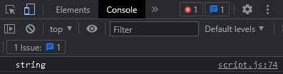

```js
let angka = 123218;

console.log(typeof angka);
```

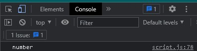

<b>Memeriksa berapa banyak karakter dalam 1 kata menggunkan length.</b>

```js
let buah = 'mangga';

console.log(buah.length);
```

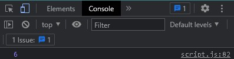

## String

<p>Objek String digunakan untuk mewakili dan memanipulasi urutan karakter. <br/>
String berguna untuk menyimpan data yang dapat direpresentasikan dalam bentuk teks. Beberapa operasi yang paling sering digunakan pada string adalah memeriksa panjangnya, membangun dan menggabungkannya menggunakan operator string + dan +=, memeriksa keberadaan atau lokasi substring dengan metode indexOf(), atau mengekstrak substring dengan substring () metode.</p>

<b>Membuat string menjadi huruf kapital dengan method toUpperCase() dan menjadi huruf kecil dengan method toLowerCase()</b>

<p>toUpperCase()</p>

```js
let buah = 'mangga';

console.log(buah.toUpperCase());
```

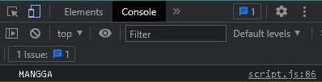

<p>Metode toUpperCase() mengembalikan nilai string panggilan yang dikonversi menjadi huruf besar.</p>
<br/>

<p>toLowerCase()</p>

```js
let buah = 'JeRuK';

console.log(buah.toLowerCase());
```

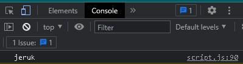

<p>Metode toLowerCase() mengembalikan nilai string panggilan yang dikonversi ke huruf kecil.</p>
<br/>

<b>Mencari / Mengembalikan 1 karakter dalam string menggunakan method charAt()</b>

```js
let buah = 'JeRuK';

console.log(buah.charAt(2));
```

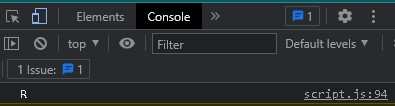

<p>Kenapa pada hasil yang ditampilkan adalah R ? kenapa bukan e yang ditampilkan ? <br/>
Karena Method CharAt() mengembalikan 1 karakter sesuai dengan Array jadinya indexnya dimulai dari 0 bukan 1, karena itulah yang dikembalikan adalah R.</p>

<b>Mencari 1 karakter atau 1 kata dalam sebuah string menggunakan method includes()</b>

```js
let buah = 'JeRuK';

console.log(buah.includes('R'));
```

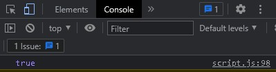

<p>Pada method includes(), ketika karakter / kata yang ingin dicari dalam string ketemu maka akan menampilkan nilainya true, bila tidak menemukannya maka nilainya false</p>

<b>Method split() memisahkan data dan mengubahnya menjadi data array</b>

```js
let kalimat = 'dengan menggunakan split(), kita dapat memisahkan sebuah string menjadi data array';
console.log('BEFORE', kalimat);
console.log('AFTER', kalimat.split(' '));
```

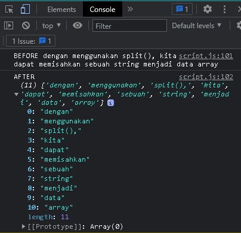

<p>Pada codingan diatas, method split membutuhkan pola dan membagi string yang dituju, dan mengubahnya menjadi array.</p>

<b>Method Number.isNan / isNan</b>

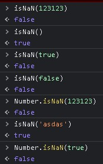

<p>Method Number.isNaN() menentukan apakah nilai yang diteruskan adalah NaN dan tipenya adalah Number. Sedangakan Method isNaN() menentukan apakah nilai yang diteruskan adalah NaN (NaN = Not A Number).</p>

<b>Method toString()</b>

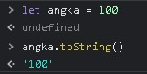

<p>Method toString berfungsi untuk merubah Number / angka menjadi String.</p>

<b>Method toFixed()</b>

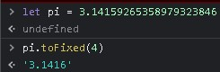

<p>Method toFixed berfungsi untuk mengambil atau menampilkan angka dibelakang koma (,) atau titik (.)</p>

<b>Math : Properti</b>

- Math.E <br/> Properti Math.E mewakili bilangan Euler, basis logaritma natural, e, yang kira-kira 2,718. <br/>
  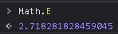

- Math.PI <br/> Properti Math.PI mewakili rasio keliling lingkaran dengan diameternya, kira-kira 3,14159 <br/>
  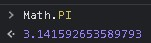

<b>Math : Method</b>

- Math.abs() <br/> Function Math.abs() mengembalikan nilai absolut dari sebuah angka. <br/>
  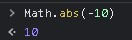

- Math.ceil() <br/> Function Math.ceil() selalu membulatkan dan mengembalikan bilangan bulat yang lebih kecil yang lebih besar dari atau sama dengan angka yang diberikan. <br/>
  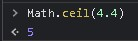

- Math.floor() <br/> Function Math.floor() selalu membulatkan ke bawah dan mengembalikan bilangan bulat terbesar yang kurang dari atau sama dengan angka tertentu. <br/>
  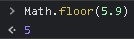

- Math.round() <br/> Function Math.round() mengembalikan nilai angka yang dibulatkan ke bilangan bulat terdekat. <br/>
  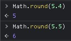

- Math.random() <br/> Function Math.random () mengembalikan angka acak antara 0 (inklusif), dan 1 (eksklusif).
  <br/>
  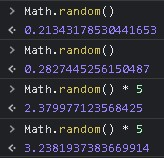

<b>Prototype</b>

```js
function Person(first, middle, last, age) {
  this.firstName = first;
  this.middleName = middle;
  this.lastName = last;
  this.age = age;
}

const Saya = new Person('Muhammad', 'Sadewo', 'Wicaksono', 50);
document.getElementById('p').innerHTML = 'Nama Saya ' + Saya.middleName;
```

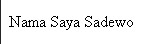

# Day 3 : Js Dasar - DOM - Introduction, Selecting Elements, dan DOM - Traversing Elements
