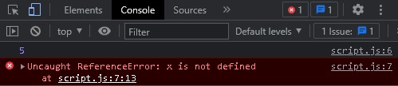
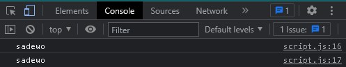
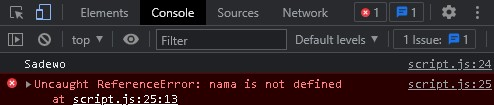
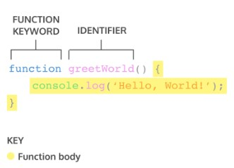
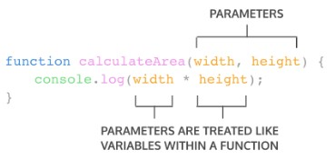
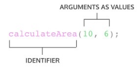
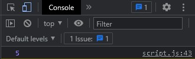
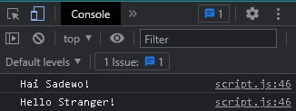
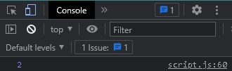

# Day 1 : Js Dasar-Scope & Function

## Js Dasar - Scope

<b>Apa itu Scope dalam Javascript ? Ada berapa macam Scope pada Javascript ?</b>

<p>Scope adalah  konsep yang digunakan untuk membatasi pengaksesan suatu variabel. Scope berfungsi untuk Menentukan suatu variabel bisa diakses pada scope tertentu atau tidak.</p>
<p>Analogi Sederhana Scope : <br/>
Bayangkan sebuah kaleng berisikan biskuit. Kita bisa memasukkan biskuit tersebut ke dalam tiap kaleng yang berbeda, dan suatu saat kita lapar, kita bisa tahu ke kaleng mana yang harus kita cari.</p>
<p>Pada analogi diatas kita bisa tahu bahwa, Variable adalah biskuit dan scope adalah kaleng. Kesimpulan : scope adalah tempat yang mengurung / menyimpan variable yang ada didalamnya.</p>

<p>Scope pada Javascript terdapat 3 tipe, yaitu Block Scope, Global Scope, dan Local / Function Scope</p>

1. Block Scope <br/> Blocks adalah code yang berada didalam curly braces {}. Pada Block Scope, jika kita melakukan console.log diluar curly braces / kurung kurawal, hanya variable var saja yang bisa terpanggil sedangkan untuk variable let dan const tidak bisa terpanggil.

```js
{
  var i = 5;
  let x = 2;
  const y = 3;
}
console.log(i);
console.log(x);
console.log(y);
```



2. Global Scope <br/> Variable yang dideklarasikan secara global (diluar function apa pun) disebut Global Scope. Global Scope dapat mendeklerasikan dengan var, let dan const ketika dideklarasikan diluar block.

```js
let nama = 'sadewo';

function orang() {
  return nama;
}

console.log(orang());
console.log(nama);
```



3. Local / Function Scope <br/> Seperti namanya, Local / Function Scope hanya dapat diakses didalam Function saja. Jika mendeklarasikan variable didalam Function, hanya Function tersebut yang dapat mengaksesnya. Bisa dibilang Local / Function Scope kebalikan dari Global yang bisa diakses dari mana saja selama masih dalam Program Javascript.

```js
function orang() {
  var nama = 'Sadewo';
  return nama;
}

console.log(orang());
console.log(nama);
```



## Js Dasar - Function

<b>Apa itu Function ? Kenapa kita membutuhkan Function pada Javascript ?</b>

<p>Function adalah sebuah blok kode yang dirancang untuk melakukan tugas / task tertentu. Function pada Javascript berfungsi untuk mempersingkat dan mempermudah programmer dalam penulisan kode atau program yang sama tidak tertulis secara berulang kali. Jadi kita hanya membuat 1 function, tetapi function tersebut dapat digunakan atau dipanggil kembali.</p>

```js
function hallow() {
  return 'Hellow~';
}
```



<p>Memanggil Function bisa dengan cara memanggil nama function nya, dan dengan console.log(namafunction());</p>

```js
hallow(); // memanggil dengan nama function
console.log(hallow()); // memanggil dengan console.log
```

### Parameter dan Argumen

<b>Parameter Function</b>

<p>Parameter Function dapat menerima sebuah inputan data dan memproses data tersebut untuk melakukan task / tugas. Saat membuat Function, harus memperhatikan data yang dibutuhkan. Misalnya mau membuat function pengurangan dengan 2 buah nilai. Data yang dibutuhkan adalah 2 buah nilai tersebut.</p>



```js
function pengurangan(a, b) {
  return a - b;
}
```

<b>Argumen Function</b>

<p>Argumen adalah nilai yang digunakan saat memanggil function. Jumlah argumen harus sama dengan jumlah parameternya. Jadi jika di function penambahan ada 2 parameter nilai saat membuat function. Saat memanggil function gunakan 2 buah nilai argumen.</p>



```js
function pengurangan(a, b) {
  return a - b;
}

console.log(pengurangan(10, 5));
```



<b>Default Parameters</b>

<p>Default paramaters digunakan untuk memberikan nilai awal/default pada parameter function. Default parameters bisa digunakan jika ingin menjaga function agar tidak error (undefined) saat dipanggil tanpa argumen.</p>

```js
// Default Parameter pada Reguler Function
function hellow(name = 'Stranger', greet = 'Hello') {
  console.log(`${greet} ${name}!`);
}

hellow('Sadewo', 'Hai');
hellow();
```

```js
// Default Parameter pada Arrow Function
const hellow = (name = 'Stranger', greet = 'Hello') => console.log(`${greet} ${name}!`);

hellow('Sadewo', 'Hai');
hellow();
```



<b>Arrow Function</b>

<p>Arrow function adalah cara lain menuliskan function. Ini adalah fitur terbaru yang ada pada ES6 (Javascript Version)</p>

```js
const pengurangan = (a, b) => {
  return a - b;
};
console.log(pengurangan(4, 2));
```



# Day 2 : Js Dasar - Data Type Built in Prototype & Method
