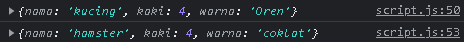

# Day 1 : JS Intermediate Array & Multidimensional Array

## JS Intermediate Array

<p>Apa itu Array ? Kenapa dalam 1 Variable Array bisa memuat lebih dari 1 data ? <br/>
Array adalah tipe data list order yang dapat menyimpan tipe data apapun di dalamnya. Array dapat menyimpan tipe data String, Number, Boolean, dan lainnya.</p>

<p>Array itu bisa dibilang sebagai kereta, karena pada array ada yang namanya Index. Index adalah urutan data pada Array, index dimulai dari 0 atau dari data pertama yang terdapat pada Array.</p>

<b>Contoh Struktur Array</b>

```js
// Tanpa Index

let buah = ["Jeruk", "Anggur", "Semangka"];
console.log(buah);
```

```js
// Menggunakan Index

let hewan = ["Kucing", "Kancul", "Kelinci"];
console.log(hewan[2]);
```


<b>Property & Method Array</b>

- Property Length <br/> Property Length mengembalikan jumlah data / element pada Array.

```js
let buah = ["Jeruk", "Anggur", "Semangka"];
console.log(buah.length);
```


- Method Push <br/> Method push() menambahkan satu atau lebih elemen ke akhir array dan mengembalikan panjang array yang baru.

```js
let buah = ["Jeruk", "Anggur", "Semangka"];
buah.push("Mangga");
console.log(buah);
// Mangga akan muncul diakhir Array
```


- Method Unshift <br/> Method unshift() menambahkan satu atau lebih elemen ke awal array dan mengembalikan panjang array yang baru.

```js
let buah = ["Jeruk", "Anggur", "Semangka"];
buah.push("Mangga");
buah.unshift("Pepaya");
console.log(buah);
// Pepaya akan muncul di Array paling awal (index - 0)
```


- Method Pop <br/> Method pop() menghapus elemen terakhir dari array dan mengembalikan elemen tersebut.

```js
let buah = ["Jeruk", "Anggur", "Semangka"];
buah.push("Mangga");
buah.unshift("Pepaya");
// Method Pop
buah.pop(); // Mangga akan hilang dari Array
console.log(buah);
```


- Method Shift <br/> Method shift() menghapus elemen pertama dari array dan mengembalikan elemen yang dihapus.

```js
let buah = ["Jeruk", "Anggur", "Semangka"];
buah.push("Mangga");
buah.unshift("Pepaya");
// Method Pop
buah.pop(); // Mangga hilang dari Array
// Method Shift
buah.shift(); // Pepaya hilang dari Array
console.log(buah);
```


- Method Splice <br/> Method splice() mengubah konten array dengan menghapus atau mengganti elemen yang ada dan/atau menambahkan elemen baru di tempatnya.

```js
// Syntax Splice()
splice(start, deleteCount, item1);
```

```js
let buah = ["Jeruk", "Anggur", "Semangka", "Pepaya", "Mangga"];
buah.splice(2); // Splice akan menghapus data dari Index 2 keatas.
console.log(buah);
```


```js
let buah = ["Jeruk", "Anggur", "Semangka", "Pepaya", "Mangga"];
buah.splice(2, 1); // Splice hanya akan menghapus data dari Index ke 2 saja.
console.log(buah);
```


```js
let buah = ["Jeruk", "Anggur", "Semangka", "Pepaya", "Mangga"];
buah.splice(2, 1, "Kelapa"); // Splice akan menghapus data pada index 2 dan menggantinya menjadi Kelapa.
console.log(buah);
```


```js
let buah = ["Jeruk", "Anggur", "Semangka", "Pepaya", "Mangga"];
buah.splice(2, 0, "Kelapa"); // Splice akan menyisipkan data Kelapa pada index ke 2 tanpa menghapus index 2 yaitu Semangka.
console.log(buah);
```


- Method Slice <br/> Method slice() mengembalikan Shallow Copy (Mengambil data dan Mengcopy data tersebut) tanpa mengubah struktur Array.

```js
// Syntax Slice()
slice(start, end);
```

```js
let buah = ["Jeruk", "Anggur", "Semangka", "Pepaya", "Mangga"];
let slice = buah.slice(2, 5); // Slice akan mengambil data array dari index 3 sampai index 5.
console.log(slice);
```


- Method Sort <br/> Method sort() adalah Method untuk mengurutkan secara Ascending atau Descending Alphanumeric.

```js
let buah = ["Jeruk", "Anggur", "Semangka", "Pepaya", "Mangga"];
buah.sort(); // Sort akan mengurutkan sesuai dengan Alphabet.
console.log(buah);
```


```js
let angka = [1, 4, 2, 5, 9];
angka.sort(); // Sort akan mengurutkan sesuai dengan Numeric.
console.log(angka);
```


- Method Reverse <br/> Method Reverse() membalikkan urutan element dalam array akan berbalik ke arah yang berlawanan dengan yang dinyatakan sebelumnya.

```js
let buah = ["Jeruk", "Anggur", "Semangka", "Pepaya", "Mangga"];
buah.reverse(); // Reverse akan membalikkan urutan Array.
console.log(buah);
```


<b>Array Loop</b>

- For (Looping Classic)

```js
// Ascending
let buah = ["Jeruk", "Anggur", "Semangka", "Pepaya", "Mangga"];
for (let i = 0; i < buah.length; i++) {
  console.log(buah[i]);
}

// Descending
for (let i = buah.length - 1; i >= 0; i--) {
  console.log(buah[i]);
}
```


- For of

```js
let buah = ["Jeruk", "Anggur", "Semangka", "Pepaya", "Mangga"];
for (let Buah of buah) {
  console.log(Buah);
}
```


- ForEach <br/> Method forEach() mengeksekusi fungsi yang disediakan satu kali untuk setiap elemen array.

```js
// Syntax
// Arrow function
forEach((element, index, array) => {
  /* … */
});
// Callback function
forEach(callbackFn, thisArg);
// Inline callback function
forEach(function (element, index, array) {
  /* … */
}, thisArg);
```

```js
let buah = ["Jeruk", "Anggur", "Semangka", "Pepaya", "Mangga"];
buah.forEach((item, index) => {
  console.log(index, item); // ForEach tidak bisa return.
});
```


- Map <br/>

```js
let buah = ["Jeruk", "Anggur", "Semangka", "Pepaya", "Mangga"];
let buahSegar = buah.map((item) => {
  return item + " " + "segar"; // Map dapat mengembalikan return
});
console.log(buahSegar);
```


## Array Multidimensional

<p>Array Multidimensi itu Array di dalam array kayak gerbong kereta, didalam kereta terdapat ruang.</p>

```js
let multiarr = [
  ["Nama", "Sadewo"],
  ["Umur", 21],
  ["Hobi", "Rebahan"],
];
console.log(multiarr[0][1]); // Yang dipanggil adalah Gerbong pertama (index 0) dan Ruang kedua (index 1)
console.log(multiarr[2][1]); // Yang dipanggil adalah Gerbong ketiga (index 2) dan Ruang kedua (index 1)
```


# Day 2 : JS Intermediate Object

## Object

<p>Object adalah sebuah tipe data pada variabel yang menyimpan properti dan fungsi (method). Properti adalah data lengkap dari sebuah object. Method adalah action dari sebuah object. Apa saja yang dapat dilakukan dari suatu object. Object tidak mempunyai Index, tetapi Object memiliki Array of Object.</p>

<b>Create Object</b>

```js
// Syntax Umum Object
let nama_obj = {
  property: "value",
  property2: "value2",
};
```

```js
let orang = {
  nama: "Sadewo",
  umur: 20,
  hobi: "Rebahan",
  "nomor handphone": 086969696969,
  // "nomor handphone" termasuk kedalam property, kenapa harus ditandai dengan double petik? karena nama property nya terdapat spasi (space). Untuk penggantinya bisa dengan nomor_handphone (Underscore).
  // Object menghilangkan angka 0 (nol) pada value.
};
console.log(orang);
```


<b>Access Object</b>

<p>Dalam mengakses object terdapat 2 cara, yaitu dengan dot notation dan bracket.</p>

1. dot notation

```js
let orang = {
  nama: "Sadewo",
  umur: 20,
  hobi: "Rebahan",
  "nomor handphone": 086969696969,
  // dot notation tidak bisa memanggil / mengakses property yang memiliki spasi seperti property nomor handphone.
  // Cara mengatasinya dengan menggunakan Bracket.
};
console.log(orang.nama);
```


2. Bracket

```js
let orang = {
  nama: "Sadewo",
  umur: 20,
  hobi: "Rebahan",
  "nomor handphone": 086969696969,
};
console.log(orang["nomor handphone"]);
```


<b>CreateKey Object</b>

<p>Penambahan Property pada Object tanpa memodifikasi Object tersebut, untuk memodifikasinya dapat menggunakan dot notation, dan Bracket.</p>

1. dot notation.

```js
let buku = {
  judul: "Jatoh kebawah",
  penulis: "oyang",
  "jumlah halaman": 500,
};
console.log(buku);
buku.penerbit = "Sidu";
console.log(buku);
```


2. Bracket

```js
let buku = {
  judul: "Jatoh kebawah",
  penulis: "oyang",
  "jumlah halaman": 500,
};
console.log(buku);
buku.penerbit = "Sidu";
console.log(buku);
buku["tahun"] = 1999;
console.log(buku);
```


<p>Note : Untuk pengurutan Property pada Object sesuai dengan Alpahbet Ascending.</p>


<b>Assign Object</b>

<p>Mengganti isi (Value) dari Object tanpa memodifikasi Object tersebut, untuk memodifikasinya dapat menggunakan dot notation, dan Bracket.</p>

1. dot notation

```js
let hewan = {
  nama: "kucing",
  kaki: 4,
  warna: "Oren",
};
console.log(hewan);
hewan.nama = "hamster"; // Mengganti value pada Property nama menjadi hamster.
hewan.warna = "coklat"; // Mengganti value pada Property warna menjadi coklat.
console.log(hewan);
```



2. Bracket

```js
let hewan = {
  nama: "kucing",
  kaki: 4,
  warna: "Oren",
};
console.log(hewan);
hewan["warna"] = "Putih"; // Mengganti value pada Property warna menjadi Putih.
console.log(hewan);
```


<b>Delete Object</b>

<p>Menghapus (Delete) Property pada object tanpa memodifikasi Object tersebut, untuk memodifikasinya dapat menggunakan dot notation.</p>

```js
let orang = {
  nama: "Sadewo",
  umur: 20,
  hobi: "Rebahan",
  "nomor handphone": 086969696969,
};
console.log(orang);
delete orang.hobi; // Menghapus Property hobi pada Object
console.log(orang);
```


<b>Method Object</b>

<p>Object yang menampung Function. Function akan melakukan return didalam Object.</p>

```js
const greeting = {
  //Function 1
  welcome: function () {
    return "Hallo World!";
  },
  //Function 2
  say: function () {
    return "!World Hallo";
  },
};
console.log(greeting.welcome()); // Memanggil Function didalam Object
console.log(greeting.say()); // Memanggil Function didalam Object
```


<b>Nested Object</b>

<p>Object yang didalamnya memiliki Object, seperti Multidimensi Array.</p>

```js
//Object
let buku = {
  judul: "Jatoh kebawah",
  tahun: 1989,
  //Object
  penulis: {
    penulis1: {
      nama: "Bagas",
      umur: 32,
      kota: "Bekasi",
    },
    //Object
    penulis2: {
      nama: "Daffa",
      umur: 28,
      kota: "Bogor",
    },
  },
};
console.log(buku);
console.log(buku.penulis.penulis1.nama); //Pemanggilan memerlukan semua object yang dilalui untuk dapat dipanggil.
console.log(buku.penulis.penulis2.umur);
```


<b>Loop Object</b>

<p>Melakukan perulangan menggunakan Object</p>

```js
let orang = {
  nama: "Sadewo",
  umur: 20,
  hobi: "Rebahan",
  asal: "Jakarta",
};
// Key = Properti, orang = nama_object
for (let key in orang) {
  console.log(orang[key]);
}
```


<p>Looping dengan Nested Object</p>

```js
let buku = {
  judul: "Jatoh kebawah",
  tahun: 1989,
  penulis: {
    penulis1: {
      nama: "Bagas",
      umur: 32,
      kota: "Bekasi",
    },
    penulis2: {
      nama: "Daffa",
      umur: 28,
      kota: "Bogor",
    },
  },
};
console.log(buku);
for (let key in buku.penulis.penulis1) {
  console.log(buku.penulis.penulis1[key], "----ini dari nested");
}
```


<b>Array of Object</b>

<p>Terdapat satu / lebih Array dalam 1 Variabel Object.</p>

```js
let users = [
  {
    nama: "Sadewo",
    umur: 20,
    alamat: "Condet",
  },

  {
    nama: "Salsa",
    umur: 19,
    alamat: "Cikarang",
  },
  {
    nama: "Aliya",
    umur: 19,
    alamat: "Depok",
  },
];
console.log(users);
```


<p>Method Map pada Array of Object</p>

```js
let users = [
  {
    nama: "Sadewo",
    umur: 20,
    alamat: "Condet",
  },

  {
    nama: "Salsa",
    umur: 19,
    alamat: "Cikarang",
  },
  {
    nama: "Aliya",
    umur: 19,
    alamat: "Depok",
  },
];
console.log(users);
let data = users.map((el) => {
  console.log(el.nama);
});
```


# Day 3 : JS Intermediate Modules & Recursive

## JS Intermediate Modules

<p>JS Modules adalah cara untuk memisahkan kode ke file yang berbeda. Keuntungan menggunakan JS Module adalah Mudah untuk mengelola kode, dan kode tidak menumpuk di 1 file. Dalam Module terdapat Export dan Import, Export mengeluarkan data, sedangkan Import Memasukkan Data. Export tidak hanya bisa untuk Array, tetapi Export bisa untuk Variabel, Object, Function, dan Class</p>

<p>Pada saat menghubungkan file HTML dengan file JS, harus menambahkan "type = module"</p>

```js
<script src="./Indo.js" type="module"></script>
```

<p>Sebelumnya siapkan 1 file JS yang akan di Export (JP.js). Dan 1 file JS yang akan di Import (Indo.js)</p>

```js
// JP.js
export let handphone = ["Sony", "Docomo", "Sharp"];

// Indo.js
import { handphone } from "./JP.js";
console.log(handphone);
// JP melakukan Export dan Indo melakukan Import.
```


<p>Penggunaan as (alias) pada saat Import</p>

```js
// JP.js
export let handphone = ["Sony", "Docomo", "Sharp"];

// Indo.js
import { handphone as hp } from "./JP.js";
console.log(hp);
```


<p>Multiple Export</p>

```js
// JP.js
export let handphone = ["Sony", "Docomo", "Sharp"];
export let motor = ["Suzuki", "Kawasaki", "Honda"];

// Indo.js
import { handphone as hp, motor as mt } from "./JP.js";
console.log(hp);
console.log(mt);
```


<p>Default Export <br/>
Default Export hanya bisa mengexport 1 kali saja. Default Export ditangkap tanpa kurung kurawal ( { } ).</p>

```js
// JP.js
let hiburan = ["Drama", "Animasi", "Komik"];
export default hiburan;

// Indo.js
import hiduran from "./JP.js"; // Pada Default Export, juga terjadi kesalahan dalam nama variable tidak terjadi Error,
console.log(hiduran); //karena JS sudah tahu variable mana yang Default Export.
```


<p>Export Function</p>

```js
// JP.js
export function hellow() {
  console.log("Hello World!");
}

// Indo.js
import { hellow } from "./JP.js";
hellow();
```


## JS Intermediate Recursive

<p>Recursive adalah function yang memanggil dirinya sendiri sampai kondisi tertentu. <br/>
Function recursive punya base case (titik paling kecil(berhenti)) dan recursion case (titik dia manggil diri dia sendiri)</p>

```js
function deretAngka(n) {
  // Base Case
  if (n == 1) {
    console.log(n);
  } else {
    deretAngka(n - 1); // Recursion Case
    console.log(n);
  }
}
```


<p>Faktorial Recursive</p>

```js
function faktorial(n) {
  // Base Case
  if (n == 1) {
    return 1;
  } else {
    return n * faktorial(n - 1); // Recursion Case
  }
}
console.log(faktorial(6));
```
