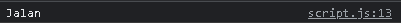

# Day 1 : JS Intermediate Asynchronous Fetch & Async Await

## JS Intermediate Asynchronous Fetch

<p>Fetch adalah proses untuk mengakses dan memanipulasi protokol server. Fetch melakukan permintaan / request terhadap server berupa API, server mengirim ke database, kembali lagi keserver dan diberikan ke website berupa data JSON untuk ditampilkan.</p>

<p>Fetch menggantikan XMLHttpRequst untuk proses request.</p>

```js
// Bentuk umum fetch
fetch("http://example.com/movies.json") // Fetch mengambil data / Request data dari Link.
  .then((response) => response.json()) // Setelah data diterima, kemudian diubah / diekstrak data tersebut menjadi data Array of Object agar dapat terbaca.
  .then((data) => console.log(data)); // Yang terakhir menampilkannya di Console.log.
```

```js
// Demo fetch 1
// Short Syntax (promise) fetch
fetch("https://digimon-api.vercel.app/api/digimon") // Fetch mengirim Request ke Server.
  // .then menangkap Request tersebut dan merubahnya menjadi Array of Obejct menggunakan .json().
  .then((result) => result.json())
  // Selanjutnya menampilkan data tersebut di console.log.
  .then((result) => {
    console.log(result);
  });
```


```js
// Demo fetch 2
// async await fetch
let fetchdata = async () => {
  let response = await fetch("https://digimon-api.vercel.app/api/digimon");
  let result = await response.json();
  console.log(result);
};
fetchdata();
```


```html
// Demo fetch 3 // Menampilkan data dengan async await + ForEach // File
index.html
<!DOCTYPE html>
<html lang="en">
  <head>
    <meta charset="UTF-8" />
    <meta http-equiv="X-UA-Compatible" content="IE=edge" />
    <meta name="viewport" content="width=device-width, initial-scale=1.0" />
    <title>Document</title>

    <script src="script.js" defer></script>
  </head>
  <body>
    <div id="list-data"></div>
  </body>
</html>
```

```js
// File script.js
listData = document.getElementById("list-data");

let fetchdata = async () => {
  let URL = "https://digimon-api.vercel.app/api/digimon";
  let response = await fetch(URL);
  let data = await response.json();
  console.log(data);

  // menampilkan 5 data
  data.slice(0, 5).forEach((item, index) => {
    listData.innerHTML += `<div>
        
        <h3>${item.name}</h3>
      </div>`;
  });
};

fetchdata();
```


## JS Intermediate Asynchronous Async Await

<p>Async Await adalah proses untuk menangkap API dan merubahnya menjadi JSON agar dapat terbaca oleh JavaScript.</p>

<p>Pada Async Await terdapat 2 model function yang dapat digunakan : </p>

```js
// async function
// async terletak pada depan function
async function asyncawait() {
  // isi function
}

// async arrow
// async terletak setelah function / depan parameter
let asyncawait = async () => {
  // isi function
};
```

```js
// Demo Async Await dengan Async Function
let pergi = (kondisi) => {
  return new Promise((resolve, reject) => {
    if (kondisi == "jalan") {
      resolve("Jalan");
    }
    reject("Ga Jadi");
  });
};

async function asyncjalan() {
  // try catch berfungsi untuk handler error.
  try {
    let result = await pergi("jalan"); // pada asycn function, tidak memerlukan .then pada functionnya.
    console.log(result);
  } catch (error) {
    console.log(error);
  }
}
asyncjalan();
```



# Day 2 : Git & Github Lanjutan

## GitHub Organization

<p>Apa itu GitHub Organization ? <br/>
GitHub Organization adalah tempat untuk mengupload project secara berkelompok / tempat repository bersama, dalam GitHub Organization kita bisa mengundang anggota, membuat repository sendiri, membuat brach baru didalam repository.</p>

<p>Membuat GitHub Organization</p>

1. Buka Github, login dan klik + disamping icon profile, dan klik New Organization.

   

2. Pilih Plan yang Free.
   

3. Masukkan nama organisasi, kontak email, klik My Personal Account, Verifikasi, centang Term of Service dan klik Next.
   
   
4. Di sini bisa mengundang anggota / member kedalam organization yang telah dibuat. Atau bisa di skip.
   
5. Untuk Surver bisa diskip dengan cara Scroll kebawah dan klik Submit.
   
   
6. Tampilan GitHub Organization
   

<p>Membuat Repo dan Branch di GitHub Organization</p>

1. Klik Tab Repositories <br/>
   
2. Klik Create a New Repository untuk membuat Repositories baru.<br/>
   
3. Masukkan Nama Repo, klik Public (Agar Member lain dapat melihatnya.), centang Add a README file, dan klik Create Repository.
   
   
4. Tampilan Repository yang telah dibuat.
   
5. Membuat Brach baru, dengan klik main, masukkkan nama untuk Branch baru, dan klik Creat branch: dev from 'main'.
   
6. Hasilnya, dev telah ditambahkan sebagai Brach baru. <br/>
   

<p>Cara berpindah Brach dan membuat Branch baru didalam Brach</p>

1. git clone terlebih dahulu repository yang tadi telah dibuat, dan buka Vscode pada Folder yang telah di git clone.
   

2. Untuk berpindah Brach ada 2 cara, yaitu dengan git switch dan git checkout.
   <br/>
   

3. Cara membuat Branch baru. <br/>
   

<p>Cara Push didalam Branch, Pull Request, dan Marge</p>

1. Siapkan File yang ingin di Push. <br/>
   
2. Melakukan git add, git commit, dan git push. <br/>
   
3. Buka GitHub Organization dan klik Compare & pull request.
   
4. Bisa langsung klik Create pull request.
   
   
5. Klik Marge pull request untuk menggabungkan project dari A-Test ke dev (Hanya Leader / Ketua saja yang dapat melakukan Marge pull request).
   
6. klik Confirm marge untuk menyetujui penggabungan.
   
7. Tampilan setelah melakukan Marge.
   

# Day 3 : Responsive Web Design & Bootstrap 5

## Responsive Web Design

<p>Responsive Web Design (RWD) bertujuan untuk membuat desain website dapat diakses dalam device apapun.</p>

<b>ViewPort</b>

<p>Viewport adalah area web yang terlihat oleh user.</p>

```html
<meta name="viewport" content="width=device-width, initial-scale=1" />
```

<p>Perhatikan di atribut content, di sana kita menggunakan beberapa variabel untuk viewport : </p>

- width untuk mengatur lebar halaman, jika membarikan nilai device-width maka lebar akan mengikuti ukuran lebar dari perangkat;
- initial-scale adalah variabel untuk mengatur sekala (zoom) dari halaman web.

<b>Max Width</b>

<p>Max-width mendefinisikan lebar maksimum suatu elemen.</p>

```html

```


<b>Relative Unit</b>

<p>Relative unit berguna untuk mendesain website yang responsif karena ukurannya bisa berubah relatif terhadap parent atau ukuran layar</p>

<p>Macam - macam satuan Unit Relative : </p>

- %: Ukurannya relatif terhadap parent element
- em: Ukurannya relatif terhadap font-size dari elemen saat ini
- rem: Ukurannya relatif terhadap font-size root elemen (<html>). "rem" = "root em"
- ch: Ukurannya mengikuti jumlah karakter (1 karakter sama dengan lebar dari karakter 0/nol font yang sedang aktif)
- vh: Ukurannya relatif terhadap tinggi viewport (ukuran jendela tau aplikasi), 1vh = 1/100 dari tinggi viewport
- vw: Ukurannya relatif terhadap lebar dari viewport. 1vw = 1/100 lebar viewport
- vmin: Ukurannya relatif terhadap ukuran viewport yang lebih kecil (misalnya diorientasi portrait, lebar akan lebih kecil daripada tinggi). 1vmin = 1/100 dari ukuran viewport yang lebih kecil.
- vmax: Sama dengan vmin, dia akan melihat ukuran viewport yang lebih besar
- ex: Ukurannya relatif terhadap tinggi dari karakter "x" kecil font yang sedang aktif.

```html
<!-- Demo Relative Unit CSS -->

<!DOCTYPE html>
<html lang="en">
  <head>
    <meta charset="UTF-8" />
    <meta http-equiv="X-UA-Compatible" content="IE=edge" />
    <meta name="viewport" content="width=device-width, initial-scale=1.0" />
    <title>Document</title>

    <link rel="stylesheet" href="./style.css" />
  </head>
  <body>
    <div class="container">
      <p class="rem">ini dari rem</p>
    </div>

    <div class="container">
      <p class="em">ini dari em</p>
    </div>
  </body>
</html>
```

```css
.container {
  font-size: 20px;
}
.rem {
  font-size: 2rem;
}
.em {
  font-size: 2em;
}
```


<b>Media Query</b>

<p>Media Query digunakan untuk mengatur CSS berdasarkan layar tampilan web, atau berdasarkan ukuran layar baik itu lebar, tingggi.</p>

```css
/* Contoh Penggunaan Media Query */
@media only screen and (max-width: 600px) {
  body {
    background-color: lightblue;
  }
}
/* Jika layar dengan lebar max 600px, 
maka ubah background-color pada body menjadi lightblue */
```

<b>Flex</b>

<p>Flex digunakan untuk mengatur elemen di suatu halaman web</p>

```html
<!-- Contoh pengguaan Flex -->
<!-- File html -->
<!DOCTYPE html>
<html lang="en">
  <head>
    <meta charset="UTF-8" />
    <meta http-equiv="X-UA-Compatible" content="IE=edge" />
    <meta name="viewport" content="width=device-width, initial-scale=1.0" />
    <link rel="stylesheet" href="./newstyle.css" />
    <title>Document</title>
  </head>
  <body>
    <h1>Membuat Flex Container</h1>

    <div class="flex-container">
      <div>1</div>
      <div>2</div>
      <div>3</div>
      <div>4</div>
      <div>5</div>
      <div>6</div>
      <div>7</div>
    </div>

    <p>
      Tata Letak Fleksibel harus memiliki elemen induk dengan properti tampilan
      yang disetel ke flex.
    </p>

    <p>
      Elemen turunan langsung dari wadah fleksibel secara otomatis menjadi item
      fleksibel.
    </p>
  </body>
</html>
```

```css
/* File CSS */
.flex-container {
  display: flex;
  background-color: green;
}

.flex-container > div {
  background-color: #f1f1f1;
  margin: 10px;
  padding: 20px;
  font-size: 30px;
}
```


## Bootstrap 5

<p>Bootstrap adalah framework HTML, CSS, dan JavaScript yang berfungsi untuk mendesain website responsive dengan cepat dan mudah.</p>

<p>Tujuan dan fungsi Bootstrap adalah untuk membuat website responsive dan mobile-first. Jadi, semua elemen antarmuka website dipastikan bisa bekerja secara optimal di semua ukuran layar, baik desktop maupun perangkat seluler. <br/>Berkat grid system yang digunakan. Sistem grid pada bootstrap menggunakan rangkaian containers, baris, dan kolom untuk menyesuaikan bentuk layout dan konten website.</p>

<p>Framework Bootstrap tersusun dari kumpulan file CSS dan JavaScript berbentuk class yang tinggal pakai. </p>

<b>Cara memasang Bootstrap pada html</b>

<p>Terdapat 2 cara dalam memasang Bootstrap, yaitu dengan cara Include via CDN dan Mendownload Compiled CSS and JS</p>

1. Include via CDN.
   Yang harus dilakukan adalah membuka Bootstrap page (https://getbootstrap.com/) dan scroll kebawah, hingga menemukan Include via CDN.
   
   Copy link pada CSS Only, dan JavaScript Bundle with Popper, kemudian masukkan copy an tersebut kedalam file html.
   
   Link CSS ditaruh diatas tag title, sedangkan link JavaScript ditaruh diatas penutup body (/body).

2. Compiled CSS and JS
   Yang harus dilakukan adalah membuka Bootstrap page (https://getbootstrap.com/) dan scroll kebawah, hingga menemukan Read installation docs, klik link tersebut.
   
   Kemudian klik Download pada Compiled CSS and JS.
   
   Ekstrak file Rar yang tadi di Download ke dalam folder html berada.
   
   Hasil Ekstrak, siap digunakan.
   

<b>Cara Penggunaan Bootstrap</b>

```html
<!DOCTYPE html>
<html lang="en">
  <head>
    <meta charset="utf-8" />
    <meta name="viewport" content="width=device-width, initial-scale=1" />
    <title>Bootstrap demo</title>
    <link
      href="https://cdn.jsdelivr.net/npm/bootstrap@5.2.2/dist/css/bootstrap.min.css"
      rel="stylesheet"
      integrity="sha384-Zenh87qX5JnK2Jl0vWa8Ck2rdkQ2Bzep5IDxbcnCeuOxjzrPF/et3URy9Bv1WTRi"
      crossorigin="anonymous"
    />
  </head>
  <body>
    <h1>Hello, world!</h1>
    <script
      src="https://cdn.jsdelivr.net/npm/bootstrap@5.2.2/dist/js/bootstrap.bundle.min.js"
      integrity="sha384-OERcA2EqjJCMA+/3y+gxIOqMEjwtxJY7qPCqsdltbNJuaOe923+mo//f6V8Qbsw3"
      crossorigin="anonymous"
    ></script>
  </body>
</html>
```


