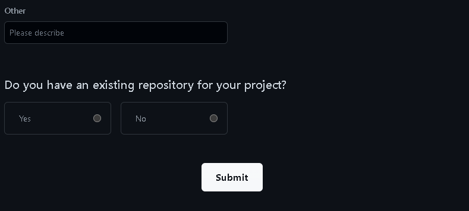

# Day 1 : JS Intermediate Asynchronous Fetch & Async Await

## JS Intermediate Asynchronous Fetch

<p>Fetch adalah proses untuk mengakses dan memanipulasi protokol server. Fetch melakukan permintaan / request terhadap server berupa API, server mengirim ke database, kembali lagi keserver dan diberikan ke website berupa data JSON untuk ditampilkan.</p>

<p>Fetch menggantikan XMLHttpRequst untuk proses request.</p>

```js
// Bentuk umum fetch
fetch("http://example.com/movies.json") // Fetch mengambil data / Request data dari Link.
  .then((response) => response.json()) // Setelah data diterima, kemudian diubah / diekstrak data tersebut menjadi data Array of Object agar dapat terbaca.
  .then((data) => console.log(data)); // Yang terakhir menampilkannya di Console.log.
```

```js
// Demo fetch 1
// Short Syntax (promise) fetch
fetch("https://digimon-api.vercel.app/api/digimon") // Fetch mengirim Request ke Server.
  // .then menangkap Request tersebut dan merubahnya menjadi Array of Obejct menggunakan .json().
  .then((result) => result.json())
  // Selanjutnya menampilkan data tersebut di console.log.
  .then((result) => {
    console.log(result);
  });
```


```js
// Demo fetch 2
// async await fetch
let fetchdata = async () => {
  let response = await fetch("https://digimon-api.vercel.app/api/digimon");
  let result = await response.json();
  console.log(result);
};
fetchdata();
```


```html
// Demo fetch 3 // Menampilkan data dengan async await + ForEach // File
index.html
<!DOCTYPE html>
<html lang="en">
  <head>
    <meta charset="UTF-8" />
    <meta http-equiv="X-UA-Compatible" content="IE=edge" />
    <meta name="viewport" content="width=device-width, initial-scale=1.0" />
    <title>Document</title>

    <script src="script.js" defer></script>
  </head>
  <body>
    <div id="list-data"></div>
  </body>
</html>
```

```js
// File script.js
listData = document.getElementById("list-data");

let fetchdata = async () => {
  let URL = "https://digimon-api.vercel.app/api/digimon";
  let response = await fetch(URL);
  let data = await response.json();
  console.log(data);

  // menampilkan 5 data
  data.slice(0, 5).forEach((item, index) => {
    listData.innerHTML += `<div>
        
        <h3>${item.name}</h3>
      </div>`;
  });
};

fetchdata();
```


## JS Intermediate Asynchronous Async Await

<p>Async Await adalah proses untuk menangkap API dan merubahnya menjadi JSON agar dapat terbaca oleh JavaScript.</p>

<p>Pada Async Await terdapat 2 model function yang dapat digunakan : </p>

```js
// async function
// async terletak pada depan function
async function asyncawait() {
  // isi function
}

// async arrow
// async terletak setelah function / depan parameter
let asyncawait = async () => {
  // isi function
};
```

```js
// Demo Async Await dengan Async Function
let pergi = (kondisi) => {
  return new Promise((resolve, reject) => {
    if (kondisi == "jalan") {
      resolve("Jalan");
    }
    reject("Ga Jadi");
  });
};

async function asyncjalan() {
  // try catch berfungsi untuk handler error.
  try {
    let result = await pergi("jalan"); // pada asycn function, tidak memerlukan .then pada functionnya.
    console.log(result);
  } catch (error) {
    console.log(error);
  }
}
asyncjalan();
```


# Day 2 : Git & Github Lanjutan

## GitHub Organization

<p>Apa itu GitHub Organization ? <br/>
GitHub Organization adalah tempat untuk mengupload project secara berkelompok / tempat repository bersama, dalam GitHub Organization kita bisa mengundang anggota, membuat repository sendiri, membuat brach baru didalam repository.</p>

<p>Membuat GitHub Organization</p>

1. Buka Github, login dan klik + disamping icon profile, dan klik New Organization.

   

2. Pilih Plan yang Free.
   

3. Masukkan nama organisasi, kontak email, klik My Personal Account, Verifikasi, centang Term of Service dan klik Next.
   
   
4. Di sini bisa mengundang anggota / member kedalam organization yang telah dibuat. Atau bisa di skip.
   
5. Untuk Surver bisa diskip dengan cara Scroll kebawah dan klik Submit.
   
   
6. Tampilan GitHub Organization
   

<p>Membuat Repo dan Branch di GitHub Organization</p>

1. Klik Tab Repositories
   
2. Klik Create a New Repository untuk membuat Repositories baru.
   
3. Masukkan Nama Repo, klik Public (Agar Member lain dapat melihatnya.), centang Add a README file, dan klik Create Repository.
   
   
4. Tampilan Repository yang telah dibuat.
   
5. Membuat Brach baru, dengan klik main, masukkkan nama untuk Branch baru, dan klik Creat branch: dev from 'main'.
   
6. Hasilnya, dev telah ditambahkan sebagai Brach baru.
   

<p>Cara berpindah Brach dan membuat Branch baru didalam Brach</p>

1. git clone terlebih dahulu repository yang tadi telah dibuat, dan buka Vscode pada Folder yang telah di git clone.
   

2. Untuk berpindah Brach ada 2 cara, yaitu dengan git switch dan git checkout.
   
   

3. Cara membuat Branch baru.
   

<p>Cara Push didalam Branch, Pull Request, dan Marge</p>

1. Siapkan File yang ingin di Push.
   
2. Melakukan git add, git commit, dan git push.
   
3. Buka GitHub Organization dan klik Compare & pull request.
   
4. Bisa langsung klik Create pull request.
   
   
5. Klik Marge pull request untuk menggabungkan project dari A-Test ke dev (Hanya Leader / Ketua saja yang dapat melakukan Marge pull request).
   
6. klik Confirm marge untuk menyetujui penggabungan.
   
7. Tampilan setelah melakukan Marge.
   

# Day 3 : Responsive Web Design & Bootstrap 5

## Responsive Web Design

<p>Responsive Web Design (RWD) bertujuan untuk membuat desain website dapat diakses dalam device apapun.</p>
