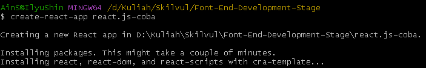
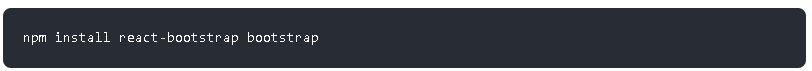

# Day 1 : React.js Basic - JavaScript for React.js, Intro to React.js, Virtual DOM, dan JSX

## React.Js

<p>React.Js adalah Framework view library javascript untuk membuat tampilan (user interface) pada website. React memungkinkan untuk membuat UI kompleks dari kumpulan kode yang kecil dan terisolasi yang disebut “komponen”.
</p>

<b>Kenapa menggunakan React.js?</b>

1. Performa <br/>React.JS menggunakan kerangka Virtual Document Object Model (VDOM) yang membuat aplikasi web berjalan lebih cepat. Dengan kerangka ini, antarmuka pengguna <b>(UI)</b> yang kompleks dapat dipecah menjadi beberapa komponen. Dengan begitu, proses pengembangan bisa berjalan lebih cepat karena memungkinkan banyak pengguna bekerja pada komponen secara bersamaan.
2. Modular <br/>Dengan React dapat menerapkan konsep modular pada Javascript. React JS membagi 1 tampilan website menjadi komponen-komponen kecil.
3. Scalable <br/>React.JS dapat digunakan pada aplikasi berskara kecil hingga besar dan kompleks.
4. Popular <br/>React.Js dikenal dengan library JavaScript yang berbasis Komponen yang dapat membantu Developer dalam pembuatan Website atau Aplikasi Mobile. Karena hal itu React.Js sangat populer di kalangan Developer.

<b>Install React.Js</b>

1. Download Node.js <br/>Link download : https://nodejs.org. Node.js menjalankan V8 JavaScript engine (yang juga merupakan inti dari Google Chrome) di luar browser. Ini memungkinkan Node.js memiliki performa yang tinggi.
2. Install Node.Js <br/> Untuk proses Installasinya hanya klik next saja, lalu diakhir klik finish.
3. Mengecek Node.Js <br/>Untuk memastikkan Node.Js telah terinstall dengan baik, maka buka cmd dan ketikan 'npm -v'. <br/> 
4. Install create-react-app <br/>Sebelum menginstall React.js kita harus menginstall Create-react-app terlebih dahulu dengan GitBash / PowerShell dan mengetikkan 'npm install -g create-react-app'. <br/>
5. Mengecek create-react-app <br/>Untuk memastikkan create-react-app telah terinstall dengan baik, maka buka cmd dan ketikan 'create-react-app --version'. <br/> 
6. Create Project React.Js <br/>Untuk membuat Project kita memerlukan CMD, PowerShell atau Git Bash, dan mengetikkan 'create-react-app nama-project'. Pada Proses Create memakan kuota dan waktu untuk mendownload. <br/>  <br/> Gambar dibawah menandakan bahwa Proses Create telah selesai <br/> 
7. Menjalankan React.js <br/> Setelah proses Create Project selesai, ketikkan 'cd nama-project' untuk berpindah kedalam project yang dibuat, dan npm start untuk memulai / menjalankan React.js di browser. <br/> <br/>  <br/> 
8. Membuka di Browser <br/>Biasanya ketika menjalankan 'npm start' akan secara otomatis langsung membuka di Browser. Jika tidak secara otomatis terbuka di Browser, ketikan http://localhost:3000/ pada Browser. <br/> 

## Virtual Document Object Model (VDOM)

<p>Virtual DOM (VDOM) adalah sebuah konsep dalam pemrograman di mana representasi ideal atau “virtual” dari antarmuka pengguna disimpan dalam memori dan disinkronkan dengan DOM “yang sebenarnya” oleh library seperti ReactDOM.</p>
<p>Virtual DOM secara singkat nya adalah sebuah javascript object (virtual) yang merepresentasikan DOM yang sebenarnya (real DOM). karena virtual dom ini adalah representasi dari real dom maka virtual dom adalah sebuah replikasi (copy) dari real dom tersebut. Berbeda konsep dengan DOM, virtual dom ini memiliki konsep yaitu setiap saat perubahan terjadi di state pada aplikasi kita maka akan membuat virtual dom yang baru (cloning).</p>


<p>Pada gambar diatas, ketika ada perubahan maka virtual dom akan membuat virtual dom baru dan melakukan comparation (diffed) dari virtual dom sebelumnya. Hanya perubahan tersebut yang akan dikirim ke real dom untuk mengupdate nya. Proses seperti ini membuat virtual DOM lebih cepat dibandingkan dengan DOM, jadi tidak perlu adanya proses re-rendering lagi pada keseluruhan DOM.</p>


<p>Pada React, setiap bagian dari UI adalah component, dan setiap component mempunyai state. React menggunakan konsep Observable Pattern dan mengamati setiap perubahan pada state. Ketika state pada sebuah component berubah, react mengupadate virtual DOM tree. Setelah virtual DOM diperbarui, React kemudian membandingkan versi sekarang virtual DOM dengan versi sebelumnya. Proses ini sering disebut dengan “diffing”. Setelah mengetahui object pada virtual DOM mana yang berubah maka hanya object tersebutlah yang akan dirubah pada real DOM. Proses seperti membuat performance aplikasi menjadi lebih baik.</p>

## JSX

<p>JSX merupakan singkatan dari JavaScript Syntax Extension atau dikenal juga dengan Javascript XML. <br/>
JSX adalah ekstensi React untuk Javasript. Sintaks JSX mirip seperti HTML, sehingga membuat kita lebih gampang menyusun elemen pada komponen React. <br/>
JSX perlu di compile untuk menjadi Javascript. Jadi sebelum ditampilkan pada browser, JSX akan dicompile menjadi javascipt terlebih dahulu. Dengan JSX kita dapat menggunakan HTML didalam file extension (.js/.jsx)</p>

<p>file .js</p>


<p>file .jsx</p>


<p>Setiap JSX hanya memiliki 1 parent element</p>


<p>Bahkan sebelum kita run / lihat pada Browser, Code Editor telah memperingatkan bahwa JSX hanya memiliki 1 parent element saja.</p>

<p>Bagaimana jika kita ingin membuat lebih dari 1 parent atau lebih ? Solusinya bisa menggunakan tag div dan tag fragment.</p>

- Menggunakan Tag div <br/>

  ```jsx
  import React from "react";
  function App() {
    return (
      <div>
        <h1>Hallo World!</h1>
        <h2>Sadewo</h2>
      </div>
    );
  }
  export default App;
  ```

- Menggunakan Tag Fragment <br/>
  ```jsx
  import React from "react";
  function App() {
    return (
      <>
        <h1>Hallo World!</h1>
        <h2>Sadewo</h2>
      </>
    );
  }
  export default App;
  ```

<p>Hasil atau Output yang ditampilkan pada Browser : </p>


## Components

<p>Component memungkinkan kamu membagi User Interface (UI) menjadi bagian-bagian yang independen dan dapat digunakan kembali, dan memikirkan setiap bagian secara terpisah. <br/>
Ada 2 cara Membuat Component, yaitu menggunakan Function dan Class.</p>

<b>Membuat Components dan menampilkan Components tersebut pada Browser.</b>

1. Buatlah folder baru didalam folder src dan berinama components (pastikan nambahkan s pada akhir, karena agar bisa memiliki lebih dari 1 component). <br/> 
2. Buatlah file dengan ekstensi .jsx (Pastikan penamaan file berawalan dengan huruf besar/kapital dan diakhiri dengan .jsx). <br/> 
3. Buatlah Function berdasarkan nama file yang telah dibuat (Pastikan Function hanya memiliki 1 parent saja, disini saya Menggunakan Function). <br/> 
4. Buka App.jsx dan tambahkan import dan nama file kedalam function app. <br/> 
5. Jalankan React.js dan copy kan link ke browser. (disini saya menggunakan vite.) <br/> 
6. Tampilan Output <br/> 

# Day 2 : React.js Basic - Functional Component, Styling (CSS Stylesheet, CSS Modules & CSS-in-JS), dan Props and State

## Functional Component

<p>Untuk Functional Component sama dengan Day 1, karena hal itu saya lewatkan dan melanjutkan ke Styling.</p>

## Styling React.js

<b>Stylesheet CSS</b>

<p>Menulis style CSS di file terpisah, cukup simpan file dengan ekstensi file.css, dan impor di aplikasi</p>

<b>Contoh Styling dengan Stylesheet CSS</b>

File App.jsx

```jsx
import React from "react";
import "./App.css";

function App() {
  return (
    <>
      <div className="container">
        
        <div className="info-profile">
          <h2>Sadewo</h2>
          <h3>Peserta Front-End</h3>
          <h3>Skilvul</h3>
        </div>
      </div>
    </>
  );
}
export default App;
```

File App.css

```css
.container {
  margin-left: 100px;
  display: flex;
}
.profile-img {
  width: 150px;
  height: 150px;
  border-radius: 100%;
  overflow: hidden;
  object-fit: cover;
}
.info-profile {
  margin-left: 20px;
}
```

<p>Output</p>


<p><b>Note : </b>Pada .jsx Atribut class berubah menjadi ClassName.</p>

<b>Styling Component React.js</b>

<p>Component yang berisikan content data, lalu nantinya akan panggil dari file App.jsx.</p>


<p><b>Note : </b>Pastikan file .jsx didalam folder components.</p>

<p>Pada File App.jsx akan memanggil Function Profile yang ada di dalam folder components dan menampilkan di Browser.</p>


<p>Output</p>


<b>Memanggil banyak data dengan Components yang sama di App.jsx</b>

<p>Yang perlu dilakukan hanya memanggil lagi atau menambahkan function kembali.</p>


<p>Output</p>


<b>Inline CSS</b>

<p>Menulis Style langsung didalam Tag html.</p>


<p><b>Note : </b>Di JSX, ekspresi JavaScript ditulis di dalam kurung kurawal, dan karena objek JavaScript juga menggunakan kurung kurawal, gaya pada contoh di atas ditulis dalam dua set kurung kurawal {{}}.</p>

<p>Output</p>


<b>Styling dengan React Bootstrap</b>

<p>React Bootstrap adalah framework CSS Bootstrap yang dibagun ulang setiap componentnya dari awal, sehingga tidak memerlukan lagi jQuery di dalamnya. Dan mampu digunakan untuk membangun sebuah user interface dengan ekosistem yang besar. <br/>
React Bootstrap Framework front-end paling populer untuk React.</p>

<p>Pada Installasi Bootstrap terdapat 2 cara, yaitu dengan 'npm install react-bootstrap bootstrap' dan dengan CDN yang ditaruh di index.html</p>

<b>Install React Bootstrap dengan npm</b>

1. Buka Webiste React Bootstrap https://react-bootstrap.github.io/getting-started/introduction, scroll kebawah dan copykan yang seperti digambar. <br/> 
2. Pastekan di terminal, dan tunggu proses installasi selesai <br/> 
3. Cek terlebih dahulu apakah React Bootstrap terpasang dengan baik pada package.json. <br/> 
4. Pasang import pada main.jsx. <br/> 
5. Selesai Installasi, mari kita coba. <br/> Saya membuat codingan sederhana untuk mencoba React Bootstrap. <br/>
   ```jsx
   import React from "react";
   function App() {
     return (
       <div className="App container">
         <h1 className="text-danger">React JS</h1>
         <button className="btn btn-primary">Submit</button>
       </div>
     );
   }
   export default App;
   ```
   Output <br/> 

<b>Install React Bootstrap dengan npm</b>

1. Buka Webiste React Bootstrap https://react-bootstrap.github.io/getting-started/introduction, scroll kebawah dan copykan yang seperti digambar. <br/> 
2. Pastekan pada index.html. <br/> 
3. Selesai Installasi, mari kita coba. <br/> Saya membuat codingan sederhana untuk mencoba React Bootstrap. <br/>
   ```jsx
   import React from "react";
   function App() {
     return (
       <div className="App container">
         <h1 className="text-waring">React JS</h1>
         <button className="btn btn-primary">Submit</button>
       </div>
     );
   }
   export default App;
   ```
   Output <br/> 

## Props and State

### Props

<p>props merupakan argumen yang di-passing dari satu komponen ke komponen lain. Cara passing props sangatlah mudah, yaitu dengan menulisnya sebagai atribut pada elemen HTML. Props digunakan untuk melakukan komunikasi data antara komponen parent dan child.</p>

<b>Contoh Penggunaan Props</b>


<p>Output</p>


### State

<p>State adalah sebuah object untuk menyimpan data pada React dan akan di render atau muat ulang ketika data mengalami perubahan.</p>

<b>useState</b>

<p>useState di panggil dalam function component untuk menambahkan suatu state lokal. React akan menyimpan state antar render. useState memberikan dua hal: nilai state saat ini dan fungsi untuk memperbarui nilai tersebut. Anda dapat memanggil fungsi ini dari sebuah event handler atau dimanapun</p>

<b>Contoh Penggunaan State</b>


<p>Output sebelum button diklik</p>


<p>Output sesudah button diklik</p>


# Day 3 : React.js Basic - Handling Events, dan Conditional Rendering

## Handling Events

<p>Event React ditulis dalam sintaks camelCase : <br/>
onClick bukannya onclick. <br/>
Penangan event yang sebenarnya ditulis di dalam kurung kurawal :<br/>
onClick={shoot} bukannya onClick="shoot()".</p>

<b>Contoh Penggunaan Handling Event</b>


<p>Output</p>


## Conditional Rendering

<p>Seperti konsep conditional statement pada JavaScript atau bahasa pemrograman pada umumnya, keyword if/else digunakan untuk mengevaluasi sebuah state untuk menentukan component mana yang akan di-render.</p>

<b>Contoh Penggunaan Conditional Rendering</b>

```jsx
import React, { useState } from "react";

const Pesan = (props) => {
  const { result } = props;

  // conditional rendering
  if (result) {
    if (result == 25) {
      return (
        <div>
          <h1 style={{ color: "green" }}>Jawabanmu benar</h1>
        </div>
      );
    } else {
      return (
        <div>
          <h1 style={{ color: "red" }}>Maaf, jawabanmu salah</h1>
        </div>
      );
    }
  } else {
    return <div />;
  }
};

export default function App() {
  const [state, setState] = useState("");
  const [result, setResult] = useState(0);

  const handleChange = (e) => {
    setState(e.target.value);
  };

  const handleClick = () => {
    setResult(state);
  };

  return (
    <div>
      <p>Berapa hasil perkalian 5 x 5 ?</p>
      <input value={state} onChange={handleChange} />
      <button style={{ marginLeft: "1rem" }} onClick={handleClick}>
        Cek Hasil
      </button>
      <Pesan result={result} />
    </div>
  );
}
```

<p>Outpun</p>


# Day 4 : React.js Lanjutan - Lifecycle Method dan Hooks

## Lifecycle Method

<p>Lifecycle secara harafiah dapat di artikan sebagai siklus hidup.</p>

Component — component di react js akan melewati tiga fase hidup, yaitu :

1. Mounting
   Mounting adalah fase ketika components di buat atau pertama kali di render ke DOM. Akses dan manipulasi DOM di lakukan pada method ini, operasi lain seperti request data dari API semuanya dilakukan di sini.
   Contoh Penggunaan Mounting.

   ```jsx
   <!-- App.jsx -->
   import React from "react";
   import Life from "./components/Life";
   function App() {
     return (
       <div>
         <Life />
       </div>
     );
   }
   export default App;
   ```

   ```jsx
   <!-- Life.jsx -->
   import { useEffect, useState } from "react";
   function Life() {
     const [isLoading, setIsLoading] = useState(false);
     console.log("Memanggil LifeCycle");
     useEffect(() => {
       console.log("LifeCycle Mount");
     }, []);
     return (
       <>
         <h1>Hallo</h1>

         <button onClick={() => setIsLoading(!isLoading)}>ubah loading</button>
         <span>{isLoading + ""}</span>
       </>
     );
   }
   export default Life;
   ```

   <b>Note :</b> UseEffect adalah sebuah function dari react yang didalamnya disertai callback. tujuan useeffect ini untuk menambahkan kemampuan untuk melakukan “efek samping” dari sebuah function component.

   Output

   

2. Updating
   Fase updating adalah fase ketika sebuah component akan di render ulang, biasanya ini terjadi ketika ada perubahan pada state atau props yang mengakibatkan perubahan DOM.
   Contoh Penggunaan Updating.

   ```jsx
   import { useEffect, useState } from "react";

   function Life() {
     const [isLoading, setIsLoading] = useState(false);
     console.log("Memanggil LifeCycle");

     useEffect(() => {
       console.log("LifeCycle Mount");
     });
     return (
       <>
         <h1>Hallo</h1>
         <button onClick={() => setIsLoading(!isLoading)}>ubah loading</button>
         <span>{isLoading + ""}</span>
       </>
     );
   }
   export default Life;
   ```

   Sebenarnya untuk codingan bisa dibilang sama, tetapi di mount kita memkai kurung siku [] di useEffect nya, fungsi dari kurung siku tersebut menampilkan data sebanyak satu kali saja. di updating kita tidak memaki kurung siku karna update data terjadi secara berulang.

   Output

   

3. Unmounting
   Fase unmounting adalah fase ketika component di hapus dari DOM. Pada fase ini hanya ada satu method yang akan di eksekusi yaitu componentWillUnmount, yang di jalankan sebelum sebuah component di hapus dari DOM.
   Contoh Penggunaan Unmounting menggunakan Axios.

   ```jsx
   import axios from "axios";
   import { useEffect, useState } from "react";

   function LifeDigiom() {
     const [isLoading, setIsLoading] = useState(false);
     const [digimons, setDigimons] = useState([]);
     console.log("Memanggil API List Digimon");

     useEffect(() => {
       console.log("List Digimon mount");
       axios("https://digimon-api.vercel.app/api/digimon").then((res) => {
         console.log(res.data);
         setDigimons(res.data);
       });
     }, []);
     console.log(digimons);

     return (
       <>
         <h1>Hallo</h1>

         <button onClick={() => setIsLoading(!isLoading)}>ubah loading</button>
         <span>{isLoading + ""}</span>

         {digimons.map((item, index) => (
           <div key={index}>
             
             <h2>{item.name}</h2>
           </div>
         ))}
       </>
     );
   }
   export default LifeDigiom;
   ```

   <b>Note : </b>Diharuskan menginstall terlebih dahulu library Axios dengan perintah 'npm install axios'. axios. mirip seperti fetch. Axios terkenal dengan keunggulannya yaitu ringan, promised-based, mendukung async dan awai untuk kode yang asinkronus.

   Output

   

## Hooks

<p>Hooks merupakan fitur baru di React 16.8. Fitur ini memungkinkan Anda menggunakan state dan fitur React lainnya tanpa menuliskan sebuah kelas. <br/>
React Hooks diperkenalkan oleh React Team untuk melakukan state management dan side effects di dalam function component. Dengan Hooks kita bisa menggunakan state dan lifecycle methods tanpa harus menulis class di React.</p>

<b>perbedaan functional component dan class component</b>


<p>Terlihat kedua component diatas, menghasilkan output yang sama, namun class menggunakan state, dan functional menggunakan state hooks</p>

<b>Kelebihan penggunaan Hook</b>

<p>Bisa dilihat dari code sebelumnya, bahwa dengan menggunakan functional component dan menggunakan hooks, maka code akan terlihat lebih clean, pendek, dan mudah dimengerti. Tim yang sudah mendevelop React pun, merekomendasikan untuk mulai menggunakan hooks karena lebih mudah dimengerti</p>

# Day 5 : React.js Lanjutan - Forms

<p>Sama seperti di HTML, React.JS menggunakan form untuk memungkinkan pengguna berinteraksi dengan halaman web. Form sendiri sangat berguna untuk user dalam halam login, register, mencari kata, mengisi biodata dan banyak lagi.</p>

<b>Penggunaan Forms React.js</b>

<p>Disini saya membuat file baru bernama Form.jsx dan dipanggil di App.jsx</p>

<b>From.jsx</b>

```jsx
import { useState } from "react";

const Form = () => {
  const [name, setName] = useState("");
  const [address, setAddress] = useState("");
  const [data, setData] = useState({});
  const [track, setTrack] = useState({});

  // console.log(name, address, track)

  const handleSubmit = (e) => {
    e.preventDefault();
    setData({ name, address, track });
    // alert(`Nama: ${name}, address: ${address} `)
    setAddress("");
    setName("");
    setTrack("");
  };

  return (
    <>
      <h1>Hallo, Tolong Masukkan Nama, Alamat, dan Track.</h1>

      <form action="" onSubmit={handleSubmit}>
        <label htmlFor="name"> Name</label>
        <input
          type="text"
          value={name}
          onChange={(e) => setName(e.target.value)}
        />

        <label htmlFor="address"> Address</label>
        <input
          type="text"
          value={address}
          onChange={(e) => setAddress(e.target.value)}
        />

        <label htmlFor="option"> Track</label>
        <select value={track} onChange={(e) => setTrack(e.target.value)}>
          <option value="">pilih track</option>
          <option value="FE">FE</option>
          <option value="BE">BE</option>
          <option value="UI">UI/UX</option>
        </select>
        <button type="submit"> Submit</button>
      </form>

      <h2>Nama : {data.name}</h2>
      <h2>Alamat : {data.address}</h2>
      <h2>Track : {data.track}</h2>
    </>
  );
};
export default Form;
```

<p>Output sebelum isi Form</p>


<p>Output sesudah isi Form</p>


<p><b>Note : </b>onChange berfungsi untuk komunikasi dengan form. mengambil data dari e.target.value, sedangkan onSubmit berfungsi untuk submit data</p>
