# Day 1 : React. JS Lanjutan - Proptypes

<p>PropTypes merupakan library untuk menvalidasi props. Ini sangat membantu dalam meminimalkan bugs saat mengembangkan App besar. Jika props tidak benar type nya maka akan muncul warning. <br/>
Pada React PropTypes sudah tidak jadi 1 library dengan React sejak versi 15.5, karena hal itu kita diwajibkan menginstall terlebih dahulu library React PropTypes sebelum digunakan.</p>

<b>Install React PropTypes</b>

<p>Untuk installasinya terbilang cukup mudah, hanya perlu memasukkan perintah 'npm install prop-types' Pada Command Prompt dan tunggu hingga proses installasinya selesai.</p>

```npm
npm install prop-types
```

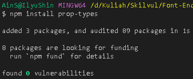

<p>Setelah berhasil terinstall, cek kembali pada package.json</p>

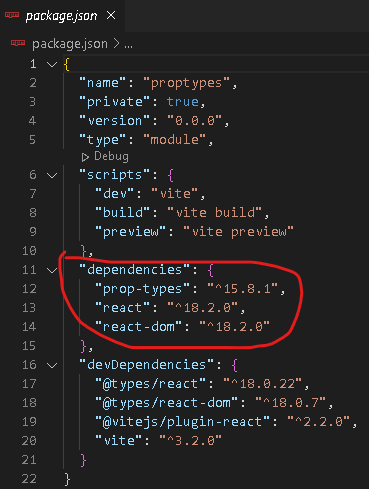

<b>Contoh penggunaan Prop-Types</b>

<p>Disini saya akan membuat contoh program sederhana mengenai PropTypes. Jadi saya akan membuat 1 file bernama Studentsinfo.jsx yang berada didalam folder components dan dipanggil di app.jsx</p>

<p>Studentsinfo.jsx</p>

```jsx
const Studentsinfo = ({ name, age }) => {
  return (
    <div>
      <h2>{name}</h2>
      <h2>{age + 5}</h2>
    </div>
  );
};

export default Studentsinfo;
```

<p>App.jsx</p>

```jsx
import Studentsinfo from "./components/studentsinfo";

function App() {
  return (
    <div className="App">
      <h1>Belajar PropTypes</h1>
      <Studentsinfo name={"Sadewo"} age={"20"} />
    </div>
  );
}

export default App;
```

<p>Output</p>

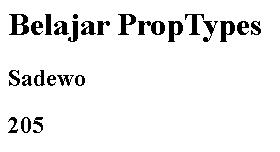

<p>Kenapa pada output untuk Age yang ditampilkan 205 ? Karena yang kita masukkan di dalam Prop App.jsx itu adalah tipe data String (" "). Disini kegunaan dari Prop-Types, Prop-Types akan mendeteksi tipe data yang digunakan untuk mempermudah proses debugging.</p>

<p>Studentsinfo.jsx</p>

```jsx
import PropTypes from "prop-types";

const Studentsinfo = ({ name, age }) => {
  return (
    <div>
      <h2>{name}</h2>
      <h2>{age + 5}</h2>
    </div>
  );
};

Studentsinfo.propTypes = {
  name: PropTypes.string,
  age: PropTypes.number,
};

export default Studentsinfo;
```

<p>Output</p>

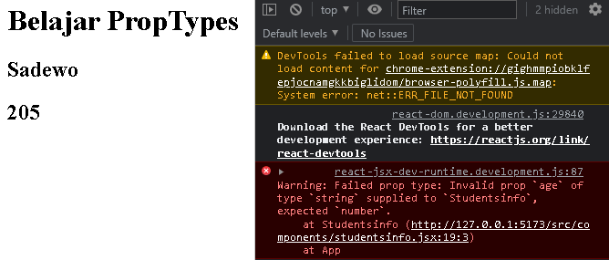

<p>Pada Output diatas kita tahu bahawa Invalid prop `age` of type `string` supplied to `Studentsinfo`, expected `number`. Yang artinya tipe data yang digunakan pada age adalah number bukan string.</p>

<p>Bagaimana cara memperbaikinya ? Cara memperbaikinya adalah mengedit kembali age prop pada App.jsx dengan menghilangkan kutip 2 (" ")</p>

```jsx
import Studentsinfo from "./components/studentsinfo";

function App() {
  return (
    <div className="App">
      <h1>Belajar PropTypes</h1>
      <Studentsinfo name={"Sadewo"} age={20} />
    </div>
  );
}

export default App;
```

<p>Output</p>

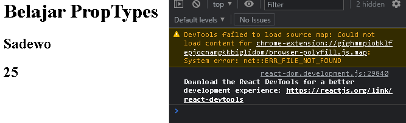

<p>Maka Warning akan hilang dari console.</p>

<p>Pada Prop-Types terdapat banyak validasi data, seperti string, number, boolean dan lain - lain.</p>

1. Type data string. <br/>
   ```jsx
   name: PropTypes.string,
   ```
2. Type data number. <br/>
   ```jsx
   age: PropTypes.number,
   ```
3. Type data bebas. <br/>
   ```jsx
   name: PropTypes.any,
   ```
4. Type data array. <br/>
   ```jsx
   data: PropTypes.array,
   ```
5. Type data object. <br/>
   ```jsx
   data: PropTypes.object,
   ```
6. Opsi pada type data. <br/>
   ```jsx
   name: PropTypes.oneOfType([PropTypes.string, PropTypes.number]),
   ```
7. Mengecek value dari props. <br/>
   ```jsx
   data: PropTypes.arrayOf(PropTypes.number),
   ```
8. Mengecek nilai dari object. <br/>
   ```jsx
   info: PropTypes.shape({
       nama: PropTypes.string,
       age: PropTypes.number,
   }),
   ```
9. Function isRequired. <br/>Fungsi isRequired artinya data harus ada. <br/>
   ```jsx
   name: PropTypes.string.isRequired,
   ```

# Day 2 : React Router

<p>Routing adalah proses di mana pengguna diarahkan ke halaman yang berbeda berdasarkan tindakan atau permintaan mereka. Router ReactJS terutama digunakan untuk mengembangkan Aplikasi Web Halaman Tunggal. React Router digunakan untuk menentukan beberapa rute dalam aplikasi. Saat pengguna mengetik URL tertentu ke browser, dan jika jalur URL ini cocok dengan ‘rute’ apa pun di dalam file router, pengguna akan diarahkan ke rute tersebut.</p>

<p>Sebelum menggunakan React Router, kita diharuskan menginstall terlebih dahulu library Router-Dom.</p>

<b>Install React-Router-Dom</b>

<p>Untuk installasi kita hanya perlu memasukkan command 'npm install react-router-dom' pada terminal dan menunggu hingga proses selesai.</p>

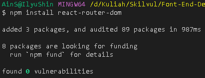

<p>Setelah selesai menginstall, cek kembali apakah sudah terpasang dengan membuka file package.json.</p>

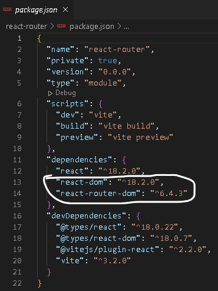

<b>Configurasi main.jsx</b>

- BrowserRoute <br/>BrowserRoute adalah Langkah termudah untuk mengatur router. Yang perlu kita lakukan adalah mengimpor router spesifik yang dibutuhkan dan bungkus seluruh aplikasi di router itu. <br/>
  ```jsx
  import React from "react";
  import ReactDOM from "react-dom/client";
  import App from "./App";
  import { BrowserRouter } from "react-router-dom";
  ReactDOM.createRoot(document.getElementById("root")).render(
    <BrowserRouter>
      <App />
    </BrowserRouter>
  );
  ```

<b>Penggunaan Route</b>

<p>Jika kita ingin membuat route, maka kita perlu page untuk berpindah halaman. Disini saya akan menyiapkan 3 file page bernama HomePage.jsx, AboutPage.jsx, dan DetailPage.jsx</p>

<p>App.jsx</p>

```jsx
import { Routes, Route, Link } from "react-router-dom";
import HomePage from "./pages/HomePage";
import AboutPage from "./pages/AboutPage";
import DetailPage from "./pages/DetailPage";

const App = () => {
  return (
    <>
      <nav>
        <Link to={"/"}>Home</Link>
        <Link to={"/about"}>About</Link>
        <Link to={"/detail"}>Detail</Link>
      </nav>

      <Routes>
        <Route path="/" element={<HomePage />} />
        <Route path="/detail/:id" element={<DetailPage />} />
        <Route path="/about" element={<AboutPage />}></Route>
      </Routes>
    </>
  );
};

export default App;
```

<p>HomePage.jsx</p>

```jsx
import { useNavigate, Link } from "react-router-dom";

const HomePage = () => {
  const navigation = useNavigate();
  let data = [
    {
      id: 1,
      nama: "Sadewo",
    },
    {
      id: 2,
      nama: "Dira",
    },
    {
      id: 3,
      nama: "Zahra",
    },
  ];

  const handleDetail = (id) => {
    navigation(`/detail/${id}`);
  };

  return (
    <>
      <h1>Home</h1>

      {data.map((el) => {
        return (
          <div>
            <h2>Nama : {el.nama}</h2>
            <button onClick={() => handleDetail(el.id)}>detail</button>
          </div>
        );
      })}

      <Link to={"about/student"}>About Student</Link>
      <Link to={"about/teacher"}>About Teacher</Link>
    </>
  );
};
export default HomePage;
```

<p><b>Note : </b>Pada HomePage.jsx, saya menggunakan useNavigate agar bisa digunakan pada function handleDetail, dan const handleDetail berfungsi untuk pindah halaman ke page detail sekaligus membawa id params.</p>

<p>Output</p>

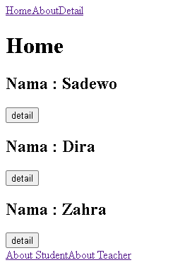

<p>Dari Output tersebut, link yang menuju about studen dan about teacher sudah ada, tetapi ketika kita klik hanya menampilkan halaman kosong. Hal ini dikarenakan kita belum menambahkan route about student dan about teacher pada App.jsx</p>

<p>App.jsx</p>

```jsx
import { Routes, Route, Link } from "react-router-dom";
import HomePage from "./pages/HomePage";
import AboutPage from "./pages/AboutPage";
import DetailPage from "./pages/DetailPage";
import AboutStudent from "./pages/AboutStudent";
import AboutSchool from "./pages/AboutSchool";
import AboutTeacher from "./pages/AboutTeacher";

const App = () => {
  return (
    <>
      <nav>
        <Link to={"/"}>Home</Link>
        <Link to={"/about"}>About</Link>
        <Link to={"/detail"}>Detail</Link>
      </nav>

      <Routes>
        <Route path="/" element={<HomePage />} />
        <Route path="/detail/:id" element={<DetailPage />} />
        <Route path="/about" element={<AboutPage />}>
          <Route path="student" element={<AboutStudent />} />
          <Route path="teacher" element={<AboutTeacher />} />
          <Route index element={<AboutSchool />} />
        </Route>
      </Routes>
    </>
  );
};

export default App;
```

<p>Pada Codingan diatas, saya membuat parent route dengan index defaultnya AboutSchool. Jika kita mengklik link about, maka akan langsung ke halaman AboutSchool dengan menambahkan outlet pada file AboutPage.jsx</p>

<p>AboutPage.jsx</p>

```jsx
import { Outlet, Link } from "react-router-dom";

const AboutPage = () => {
  return (
    <>
      <Outlet />
      <Link to={"student"}>About Student |</Link>
      <Link to={"teacher"}>About Teacher</Link>
    </>
  );
};

export default AboutPage;
```

peran `<Outlet/>` mirip dengan `<children/>`, bedanya hasil render dari `<Outlet/>` ini akan dinamis berdasarkan path URL yang terdaftar. dari contoh diatas, terdapat Route parent dengan path='/about' yang memiliki children dengan path='student' dan path='teacher', `<Outlet/>` akan merender children tersebut sebagai `<AboutPage />` saat akses URL-nya /student (/ sebagai parent + student sebagai children), dan akan merender `<DashboardTasks />` saat akses URL-nya /teacher (/ sebagai parent + teacher sebagai children). nah pada kali ini saya memberikan AboutSchool sebagai index. maka yang akan dirender ketika mengklik about adalah AboutSchool.

<p>Output</p>

<p></p>

<p>Berikutnya kita akan membuat DetailPage.jsx. Fungsi dari DetailPage.jsx adalah ketika kita mengklik button detail pada HomePage.jsx, Data yang berupa ID dari HomePage.jsx akan ditampilkan pada DetailPage.jsx</p>

<p>Jika kita menekan salah satu dari 3 button yang ada, jika menekan button yang bernama Sadewo, maka handleDetail akan memanggil data yang berada di file DetailPage.jsx dan menampilkannya.</p>

<p>DetailPage.jsx</p>

```jsx
import { useParams } from "react-router-dom";

const DetailPage = () => {
  const { id } = useParams();
  console.log(id);

  const detailInfo = [
    {
      id: 1,
      name: "Sadewo",
      address: "Jakarta",
      hobby: "Membaca",
    },
    {
      id: 2,
      name: "Dira",
      address: "Bogor",
      hobby: "Melukis",
    },
    {
      id: 3,
      name: "Zahra",
      address: "Depok",
      hobby: "Menggambar",
    },
  ];

  return (
    <>
      {detailInfo
        .filter((el) => el.id === +id)
        .map((el) => {
          return (
            <div key={el.id}>
              <h2>Name: {el.name}</h2>
              <h2>Address: {el.address}</h2>
              <h2>Hobby: {el.hobby}</h2>
            </div>
          );
        })}
    </>
  );
};

export default DetailPage;
```

<p>Output</p>

<p>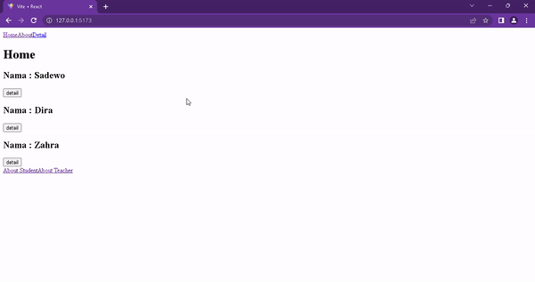</p>

<p><b>Note : </b>Pada DetailPage.jsx,saya menggunakan useParams untuk menangkap id yang kita kirim dari halaman home dengan mencocokkan data yang dikirim dari home dan melakukan Mapping data untuk menampilkan hasil yang sesuai dari data filter.</p>

# Day 3 & 4: State Management React Redux

<p>State management library adalah library yang digunakan untuk mengelola state pada suatu aplikasi JavaScript.</p>

<b>Kenapa kita menggunakan Redix ? </b>

<p>Redux akan mempermudah dalam mengelola state dimana mengubah state di child-child component tanpa harus membuat bantuan dengan props didalam component didalam props component. Dalam hal ini, redux menggunakan state yang bisa dishare diseluruh aplikasi, menggunakan middleware.</p>

<b>Bagaimana cara kerja Redux ? </b>


<p>Alur kerja Redux : </p>

1. Pertama akan ada triger dari UI
2. Kemudian akan ke action
3. Dari action reducer akan mengubah state yang sesuai dengan
4. type dari action tadi
5. Terahir update UI lagi

<p>Terdapat 4 Faktor Utama : </p>

1. UI (Tampilan Website / Aplikasi)
2. Action <br/>Sebuah function yang mereturn sebuah objek. Objek tersebut memiliki sebuah property wajib yaitu type. Type inilah yang menentukan bagaimana statenya akan diubah.
3. Reducer <br/> Sebuah function yang tugasnya untuk mengolah state yang ada di store. Misal menambah data, menghapus data, mengambil data, dsb. Ada 2 parameter wajib dari reducer, yaitu state dan action.
4. Store <br/> Store adalah tempat untuk menampung state. Store dalam Front-End dibilang sebagai database untuk Front-End.

<b>Install React Redux</b>

<p>Sebelum menggunakan Redux, kita diwajibkan menginstall terlebih dahulu. Pastika kita menggunakan React versi 16.8.3 keatas, karena versi tersebut yang support dengan React Redux 8.x.</p>

<p>Untuk Installasinya mirip dengan react router, kita hanya memasukkan command 'npm install redux react-redux' kedalam terminal.</p>

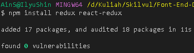

<p>Setelah selesai menginstall, cek kembali apakah sudah terpasang dengan membuka file package.json.</p>

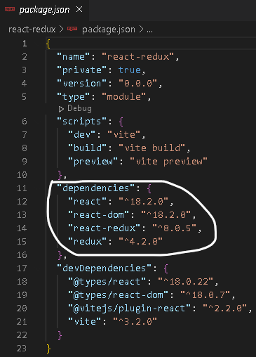

<b>Membuat React Redux dengan Contoh Kasus Counter</b>

<p>Yang pertama saya lakukan adalah membuat components terlebih dahulu.</p>

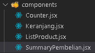

<p>Selanjutnya saya akan membuat komponen redux.</p>

<p>Membuat Store</p>

<p>Store adalah tempat untuk menampung state. Store dalam Front-End dibilang sebagai database untuk Front-End.</p>

<p>../redux/store/index.js</p>

```jsx
import { createStore } from "redux";

const store = createStore();

export default store;
```

<p>Membuat Reducer</p>

<p>Sebuah function yang tugasnya untuk mengolah state yang ada di store. Terdapat 2 parameter wajib dari reducer, yaitu state dan action.</p>

<p>../redux/reducer/keranjangReducer.js</p>

```jsx
const initialState = {
  totalKeranjang: 0,
};

function KeranjangReducer(state = initialState, action) {
  switch (action.type) {
    default:
      return state;
  }
}

export default KeranjangReducer;
```

<p>Setelah membuat reducer, selanjutnya kita hubungkan reducer dengan store yang telah dibuat.</p>

<p>../redux/store/index.js</p>

```jsx
import { createStore } from "redux";
import keranjangReducer from "../reducer/keranjangReducer";

const store = createStore(keranjangReducer);

export default store;
```

<p>Pada component Keranjang.jsx saya menambahkan console.log untuk debungging / mengetes apakah codingan yang saya buat benar.</p>

<p>../components/Keranjang.jsx</p>

```jsx
import React from "react";
import { useSelector } from "react-redux";

function Keranjang() {
  const state = useSelector((state) => state);

  console.log(state);

  return (
    <div>
      <span>Keranjang</span>
      <span>0</span>
    </div>
  );
}

export default Keranjang;
```

<p>Output</p>

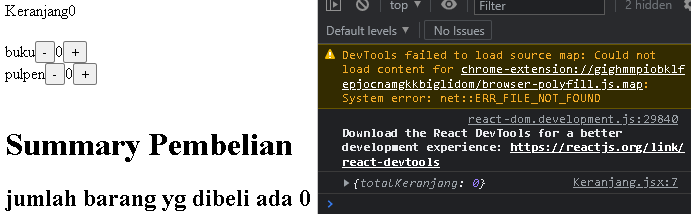

<p>Console.log akan menampilkan data berupa object. Yang artinya data dari state Keranjang.jsx sudah ada dan data dari totalKeranjang didapatkan dari useSelector yang memanggil state dari totalKeranjang yang ada pada file keranjangReducer.js.</p>

<p>Membuat Provide pada main.jsx</p>

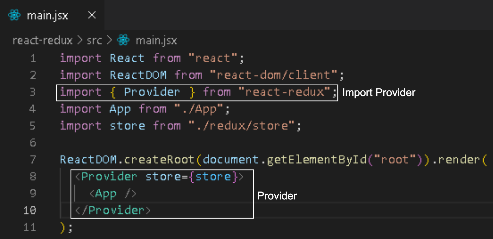

<p>Men destructuring pada codingan Keranjang.jsx dan memasukkan totalKeranjang kedalam function.</p>

<p>../components/Keranjang.jsx</p>

```jsx
import React from "react";
import { useSelector } from "react-redux";

function Keranjang() {
  const { totalKeranjang } = useSelector((state) => state);
  // console.log(state)

  return (
    <div>
      <span>Keranjang</span>
      <span>{totalKeranjang}</span>
    </div>
  );
}

export default Keranjang;
```

<p>Membuat file action didalam folder redux/action</p>

<p>../redux/action/keranjangAction.js</p>

```jsx
/* export */
export const INCREMENT_KERANJANG = "INCREMENT_KERANJANG";
export const DECREMENT_KERANJANG = "DECREMENT_KERANJANG";

/* 2 export function dibawah berfungsi untuk me return 
function pada keranjangReducer.js */
export function incrementKeranjang() {
  console.log("action dipanggil");
  return {
    type: INCREMENT_KERANJANG,
  };
}

export function decrementKeranjang() {
  return {
    type: DECREMENT_KERANJANG,
  };
}
```

<p>Setelah membuat file keranjangAction.js, kita harus mengedit kembali file keranjangReducer.js. Yang kita edit adalah penambahan import dari keranjangAction.js</p>

<p>../redux/reducer/keranjangReducer.js</p>

```jsx
/* import dari keranjangAction.js */
import {
  INCREMENT_KERANJANG,
  DECREMENT_KERANJANG,
} from "../action/keranjangAction";

const initialState = {
  totalKeranjang: 0,
};

function keranjangReducer(state = initialState, action) {
  console.log(action);

  switch (action.type) {
    case INCREMENT_KERANJANG:
      return {
        totalKeranjang: state.totalKeranjang + 1,
      };
    case DECREMENT_KERANJANG:
      return {
        totalKeranjang: state.totalKeranjang - 1,
      };
    default:
      return state;
  }
}

export default keranjangReducer;
```

<p>../components/Counter.jsx</p>

```jsx
import React, { useState } from "react";
/* import useDiscpatch dari react-redux*/
import { useDispatch } from "react-redux";
/* import function dari keranjangAction*/
import {
  incrementKeranjang,
  decrementKeranjang,
} from "../redux/action/keranjangAction";

function Counter() {
  const dispatch = useDispatch();
  const [count, setCount] = useState(0);

  const increment = () => {
    dispatch(incrementKeranjang());
    setCount(count + 1);
  };

  const decrement = () => {
    dispatch({
      type: "DECREMENT_KERANJANG",
    });
    setCount(count - 1);
  };

  return (
    <>
      <button onClick={decrement}>-</button>
      <span>{count}</span>
      <button onClick={increment}>+</button>
    </>
  );
}

export default Counter;
```

Fungsinya **useDispatch** adalah untuk mengirim action kedalam komponen. nah dari codingan diatas saya memakai useDispatch karena saya mau menampilkan data yang ada pada keranjangAction.

<p>Membuat components SummaryPembelian.jsx <br/>
Pada SummaryPembelian.jsx kita memnggunakan konsep yang sama dengan Keranjang.jsx, yaitu kita hanya perlu destructur menjadi totalKeranjang.</p>

<p>../components/SummaryPembelian.jsx</p>

```jsx
import React from "react";
import { useSelector } from "react-redux";

function SummaryPembelian() {
  const { totalKeranjang } = useSelector((state) => state);

  return (
    <div>
      <h1>Summary Pembelian</h1>
      <h2>jumlah barang yg dibeli ada {totalKeranjang}</h2>
    </div>
  );
}

export default SummaryPembelian;
```

<p>Output</p>

<p>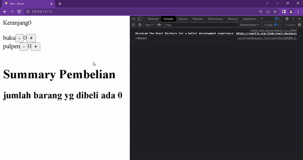</p>

<b>Combine Reducer</b>

<p>combineReducer digunakan apabila kita mempunyai reducer lebih dari satu.</p>

<p>Contoh penggunaan combine reducer</p>

```js
import { combineReducers, createStore } from "redux";
// import reducer dari counterReducer
import counterReducer from "../reducer/counterReducer";
// import reducer dari todolistReducer
import todolistReducer from "../reducer/todolistReducer";

const allReducer = combineReducers({
  counter: counterReducer,
  todo: todolistReducer,
});
const store = createStore(allReducer);
export default store;
```

# Day 5 : Async Actions with Middleware and Thunk

<p>Thunk adalah konsep pemrograman yang menggunakan fungsi untuk menunda evaluasi/kalkulasi suatu operasi.</p>

<p>Redux Thunk adalah middleware yang memungkinkan Anda memanggil pembuat aksi yang mengembalikan fungsi sebagai ganti objek aksi. Fungsi itu menerima metode pengiriman penyimpanan, yang kemudian digunakan untuk mengirim aksi sinkron di dalam isi fungsi setelah operasi asinkron selesai.</p>

<p>Pada dasarnya async tidak bisa dijalankan di action. Maka solusinya kita butuh midleware yang disebut Redux thunk.</p>

<p>Kita diharuskan menginstall terlebih dahulu react-redux-thunk, seperti react-redux yang diluar library react.</p>

<b>Install React-redux-thunk</b>

<p>Untuk installasi kita hanya perlu memasukkan command 'npm install redux-thunk' pada terminal dan menunggu hingga proses selesai.</p>

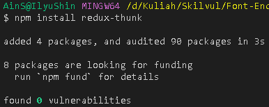

<p>Setelah selesai menginstall, cek kembali apakah sudah terpasang dengan membuka file package.json.</p>

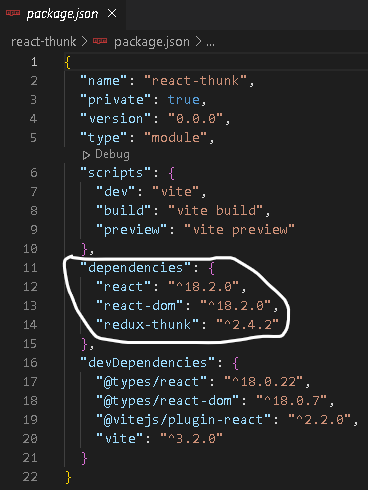

<p>Sebelum melakukan coding, saya ingin menginstall Axios. <br/> Axios merupakan library opensource yang digunakan untuk request data melalui http. Axios terkenal dengan keunggulannya yaitu ringan, promised-based, mendukung async dan awai untuk kode yang asinkronus.</p>

<b>Install Axios</b>

<p>Untuk installasi kita hanya perlu memasukkan command 'npm install axios' pada terminal dan menunggu hingga proses selesai.</p>

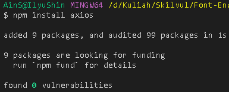

<p>Setelah selesai menginstall, cek kembali apakah sudah terpasang dengan membuka file package.json.</p>

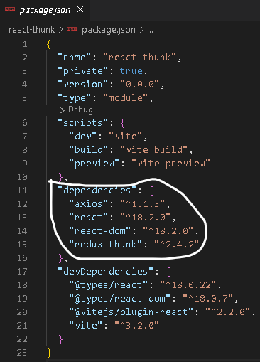

<b>Redux-Thunk dengan kasus TodoList</b>

<p>Pertama saya akan membuat folder redux, didalam folder redux ada folder action, reducer, dan store.</p>

<p>../redux/action/todoAction.js</p>

```js
// import axios yang tadi diinstall
import axios from "axios";
// export function
export const GET_TODO = "GET_TODO";
export const FETCH_START = "FETCH_START";
export const SUCCESS_GET_TODO = "SUCCESS_GET_TODO";

function fetchStart() {
  return {
    type: FETCH_START,
  };
}

function successGetTodo(data) {
  return {
    type: SUCCESS_GET_TODO,
    payload: data,
  };
}

export const getTodo = () => {
  return async (dispatch) => {
    // Mengubah loading yang awalnya false menjadi true
    dispatch(fetchStart());
    // result API isi data todos, loading jadi false
    const result = await axios.get(
      "https://63478a450484786c6e82998f.mockapi.io/todo"
    );
    dispatch(successGetTodo(result.data));
  };
};
```

<p>../redux/reducer/todoReducer.js</p>

```js
// import function dari todoAction.js
import { FETCH_START, SUCCESS_GET_TODO } from "../action/todoAction";

// variable untuk menampung isi API
const initialState = {
  todos: [],
  isLoading: false,
  err: null,
};

// Proses reducer
const todoReducer = (state = initialState, action) => {
  switch (action.type) {
    case FETCH_START:
      return {
        ...state,
        isLoading: true,
      };
    case SUCCESS_GET_TODO:
      return {
        ...state,
        todos: action.payload,
        isLoading: false,
      };
    default:
      return state;
  }
};

export default todoReducer;
```

<p>../redux/store/index.js</p>

```js
import { createStore, combineReducers, applyMiddleware } from "redux";
import thunk from "redux-thunk";
// import function dari todoReducer.js
import todoReducer from "../reducer/todoReducer";

// combineReducers bisa menggabungkan 2 atau lebih reducer dalam 1 Store.
const allReducer = combineReducers({
  todo: todoReducer,
});

const store = createStore(allReducer, applyMiddleware(thunk));

export default store;
```

<p>../src/main.jsx</p>

```jsx
import React from "react";
import ReactDOM from "react-dom/client";
import App from "./App";
import { Provider } from "react-redux"; /* import provider */
import store from "./redux/store"; /* import store */

ReactDOM.createRoot(document.getElementById("root")).render(
  // <React.StrictMode>
  /* Memanggil Store */
  <Provider store={store}>
    <App />
  </Provider>
  // </React.StrictMode>
);
```

<p>../src/components/TodoList.jsx</p>

```jsx
import React, { useEffect } from "react";
import { useDispatch, useSelector } from "react-redux";
/* import  function dari todoAction.js*/
import { getTodo } from "../redux/action/todoAction";

function TodoList() {
  const dispatch = useDispatch();
  const { todos, isLoading } = useSelector((state) => state.todo);

  /* useEffect untuk mengambil data dari function getTodo */
  useEffect(() => {
    dispatch(getTodo());
  }, []);

  return (
    <div>
      <h2>Todo List</h2>

      <ul>
        {isLoading ? (
          <span>Loading...</span>
        ) : (
          todos.map((item) => <li key={item.id}>{item.todo}</li>)
        )}
      </ul>
    </div>
  );
}

export default TodoList;
```

<p>../src/App.jsx</p>

```jsx
import TodoList from "./components/TodoList";

function App() {
  return (
    <div className="App">
      <TodoList />
    </div>
  );
}

export default App;
```

<p>Output</p>

<p>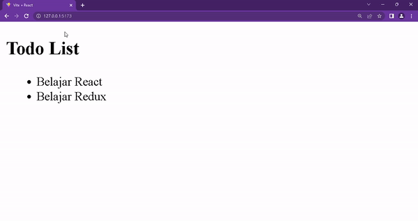</p>
