# Day 1 & 2 : React Context & React Context with useReducer

## React Context

<p><b>Context</b> membuat kita bisa mengirim data dari satu component ke component lain baik itu parent, child atau sibling component tanpa harus menambahkan props di setiap component yang 'dilewati'.</p>

<p>Kenapa dibuat Context ? kan kita bisa menggunakan props. Karena Context dapat menghindari masalah seperti props drilling.</p>

<p>Context berbeda dengan Redux. Redux state management data dalam 1 tempat, sedangkan Context bukan state management, Context hanya membuat data state yang diinginkan bersifat global agar dapat digunakan oleh component lain.</p>

<b>Penjelasan props drilling.</b>

<p>Semisalnya dalam sebuah React App memiliki beberapa Component seperti gambar dibawah.</p>

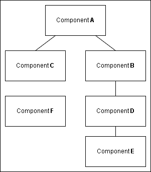

<p>Jika kita ingin mengirim data dari component A ke component E, maka kita harus menambahkan props di component C dan D dan manambahkan props lagi di component D dan E. Yang membuat kita diharuskan membuat props disetiap component yang dilewati. Yang akan menyebabkan props drilling..</p>

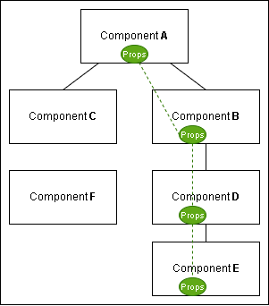

<p>Hal tersebut tidak akan terjadi jika React App hanya memiliki sedikit component.</p>

<b>Contoh penggunaan React Context</b>

<p>Saya akan membuat Program sederhana menggunakan Context. Saya akan membuat folder context, didalam folder context terdapat file bernama UserProvider.jsx, di file tersebut state disimpan dan menunggu dipanggil.</p>

<p>UserProvider.jsx</p>

```jsx
import React, { createContext, useState } from "react";

export const UserContext = createContext();

function UserProvider({ children }) {
  const [user, setUser] = useState({
    name: "Sadewo",
    email: "dewo@gmail.com",
  });

  return (
    // Value akan berisikan data berupa object
    <UserContext.Provider value={{ user, setUser }}>
      {children}
    </UserContext.Provider>
  );
}

export default UserProvider;
```

<p>Setelah membuat file UserProvider.jsx, selanjutnya mengedit file App.jsx dan Main.jsx.</p>

<p>App.jsx</p>

```jsx
// Import useContext dari react dan UserContext dari UserProvider.
import { useContext } from "react";
import { UserContext } from "./context/UserProvider";

function App() {
  // Destructur dan yang kita ambil hanya data user saja
  const { user } = useContext(UserContext);

  return (
    <div className="App">
      {/* Memanggil const user dan data yang diinginkan */}
      <h1>{user.name}</h1>
      <h2>{user.email}</h2>
    </div>
  );
}

export default App;
```

<p>Main.jsx</p>

```jsx
import React from "react";
import ReactDOM from "react-dom/client";
import App from "./App";
// Impoer UserProvider dari UserProvider
import UserProvider from "./context/UserProvider";

ReactDOM.createRoot(document.getElementById("root")).render(
  // Memanggil UserProvider
  <UserProvider>
    <App />
  </UserProvider>
);
```

<p>Output</p>


## React Context with UseReducer

<p>Materinya sama seperti hari pertama, yaitu React Context. Dihari kedua ini React Context digabung dengan useReducer.</p>

<b>Contoh Penggunaan React Context with useReducer</b>

<p>Disini saya akan membuat Counter sederhana menggunakan Context dan useReducer. Pada Counter terdapat 2 folder yaitu folder context dan folder components. Pada folder context terdapat file CounterProvider.jsx sedangakn di folder components terdapat file Counter.jsx.</p>

<p>Counter.jsx</p>

```jsx
import React, { useContext } from "react";
import { CounterContext } from "../context/CounterProvider";

function Counter() {
  const { state, increment, decrement } = useContext(CounterContext);

  return (
    <div>
      <button onClick={decrement}>-</button>
      <span>{state.count}</span>
      <button onClick={increment}>+</button>
    </div>
  );
}

export default Counter;
```

<p>CounterProvider.jsx</p>

```jsx
import React, { createContext, useReducer, useState } from "react";

export const CounterContext = createContext();

const INCREMENT = "INCREMENT";
const DECREMENT = "DECREMENT";

const initialState = {
  count: 0,
};

function reducer(state, action) {
  switch (action.type) {
    case INCREMENT:
      return { count: state.count + 1 };
    case DECREMENT:
      return { count: state.count - 1 };
    default:
      return state;
  }
}

// Penggunaan useReducer.
function CounterProvider({ children }) {
  const [state, dispatch] = useReducer(reducer, initialState);

  const increment = () => {
    dispatch({ type: INCREMENT });
  };

  const decrement = () => {
    dispatch({ type: DECREMENT });
  };

  return (
    <CounterContext.Provider value={{ state, increment, decrement }}>
      {children}
    </CounterContext.Provider>
  );
}

export default CounterProvider;
```

<p>Setelah membuat 2 file tersebut, kemudian kita harus mengedit file App.jsx dan Main.jsx.</p>

<p>App.jsx</p>

```jsx
import Counter from "./components/Counter";

function App() {
  return (
    <div className="App">
      <Counter />
    </div>
  );
}

export default App;
```

<p>Main.jsx</p>

```jsx
import React from "react";
import ReactDOM from "react-dom/client";
import App from "./App";
import CounterProvider from "./context/CounterProvider";

ReactDOM.createRoot(document.getElementById("root")).render(
  // <React.StrictMode>
  <CounterProvider>
    <App />
  </CounterProvider>
  // </React.StrictMode>
);
```

<p>Output</p>

<p>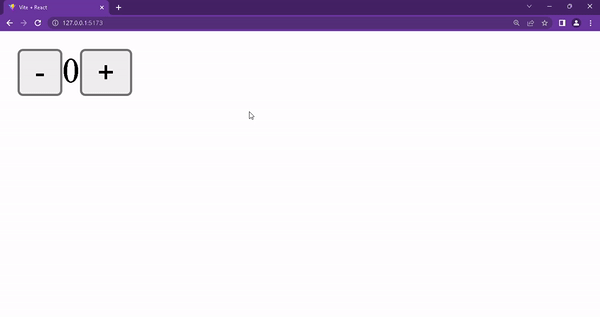</p>

# Day 3 : React Testing (Jest & RTL)

<p>React Testing adalah sebuah test atau uji secara manual atau otomatis. Tujuan React Testing adalah untuk menguji apakah Website atau aplikasi yang kita buat berjalan dengan baik dan benar seperti yang kita inginkan.</p>

<p>Sebelum melanjutkan pembahasan React Testing, saya ingin menjelaskan tentang TTD (Test Driven Development).</p>

<b>TTD (Test Driven Development)</b>

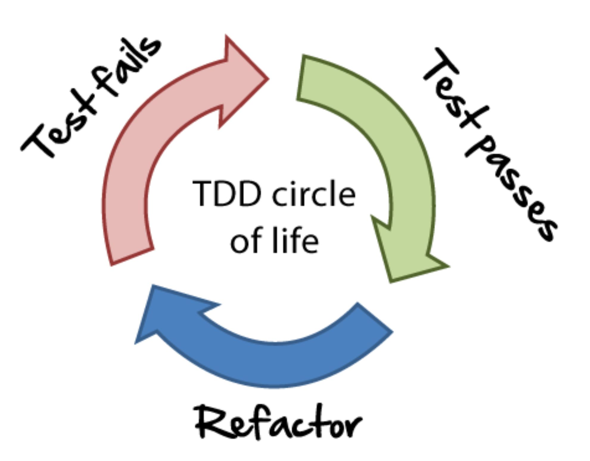

<p>Test-driven development (TDD) adalah pendekatan untuk pengembangan perangkat lunak di mana praktisi melakukan interleave proses pengujian dan pengembangan kode. Pada dasarnya, praktisi membangun kode secara bertahap, bersama dengan pengujian untuk increment itu. Praktisi tidak beralih ke increment berikutnya sampai kode yang dikembangkan lolos uji.</p>

<p>Terdapat 2 jenis React Testing, yaitu Jest dan React Testing Library (RTL).</p>

## Jest

<p>Disini saya akan mencontohkan penjumlahan sum dan menggunakan Jest sebagai testing.</p>

<p>Sebelum mulai coding, kita diharuskan menginstall terlebih dahulu Dependenci Jest dengan masukkan command 'npm install -D jest'.</p>

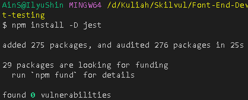

<p>Setelah menginstall, kita harus edit file package.json dan menambahkan scripts.</p>

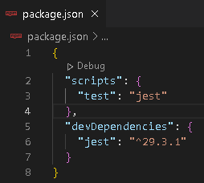

<p>Saya akan membuat 2 file dengan nama App.js dan App.test.js.</p>

<p>App.js</p>

```js
function sum(x, y) {
  return x + y;
}
module.exports = sum;
```

<p>App.test.js</p>

```js
const sum = require("./app");

test("Penjumlahan dengan sum()", () => {
  expect(sum(0, 0)).toBe(0);
  expect(sum(0, 1)).toBe(1);
  expect(sum(1, 1)).toBe(2);
  expect(sum(1, 2)).toBe(3);
  expect(sum(2, 2)).toBe(4);
});
```

<p>Fungsi dari file App.js adalah sebagai tempat untuk menampung function yang akan berjalan. Sedangkan App.test.js adalah sebagai tempat yang diharapkan atau expect dari function yang berjalan di App.js.</p>

<p>Cara menjalankan Testnya adalah dengan commnad 'npm run test'.</p>

<p>Output</p>

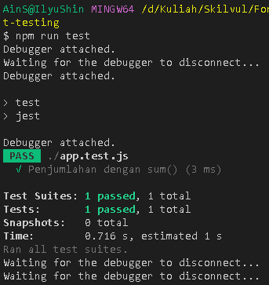

<p>Pada hasil output, bahwa test nya berhasil atau PASS. Jika hasil nya Pass berarti kita telah melewati Test Passes pada TTD.</p>

<p>Bagaimana kita membuat codingan yang salah ?</p>

<p>Mari kita edit App.js dan 'npm run test' lagi.</p>

<p>App.js</p>

```js
function sum(x, y) {
  return x - y;
}
module.exports = sum;
```

<p>Tanpa dilakukan Test, kita tahu bahwa hasilnya akan error bila 0 - 1.</p>

<p>Output</p>

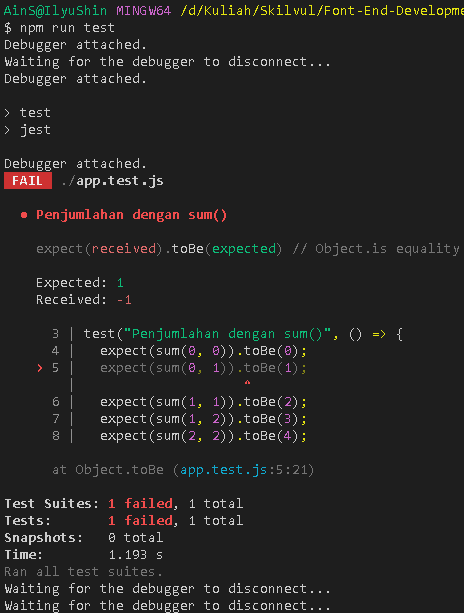

<p>Pada hasil run, Debugger attached menyatakan Fail atau gagal. Seharusnya Expect yang didapatkan sama yang diinginkan. Jest juga menampilkan error pada baris ke 5 yang seharusnya 1 menjadi -1 karena 0 - 1.</p>

<p>Biasanya jika kita sudah lolos Test Passes, kita akan masuk ke bagian Refactor. <br/> Refactoring adalah proses mengubah sistem dari suatu perangakat lunak tanpa mengubah perilaku eksternal (fungsionalitas akhir) dari perangkat lunak tersebut. Tujuan utama dari refactoring adalah meningkatkan kualitas struktur internal dari perangkat lunak. Refactoring merupakan langkah untuk “membersihkan” code sehingga dapat meminimalkan peluang munculnya software defect (bug) pada implementasi yang dibuat. Jadi secara umum, ketika kita melakukan refactor, kita sedang meningkatkan kualitas desain dari perangkat lunak kita.</p>

<p>Kita edit lagi App.js agar lebih simple dengan Arrow Function.</p>

```js
const sum = (x, y) => x + y;

module.exports = sum;
```

<p>Terlihat dengan jelas, menggunakan Arrow Function menjadi lebih simple dibandingkan menggunakan Function biasa.</p>

<p>Output</p>

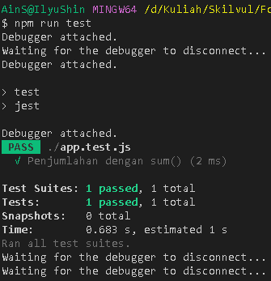

<p>Perbandingan sebelum dan sesudah Refactor.</p>

<p>Sebelum</p>

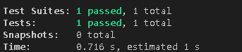

<p>Sesudah</p>

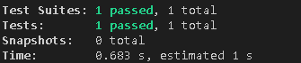

<p>Setelah di Refactor, proses test berjalan lebih cepat selesai dibandingkan sebelum di Refactor.</p>

<b>Jest --coverage</b>

<p>Jest mengumpulkan cakupan pada fungsi yang sedang diuji, bukan dari keseluruhan proyek.</p>

<p>Sebelum melakukan test, kita harus edit file package.json kembali.</p>

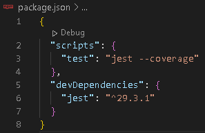

<p>Setelah di edit, mari lakukan test kembali.</p>

<p>Output</p>

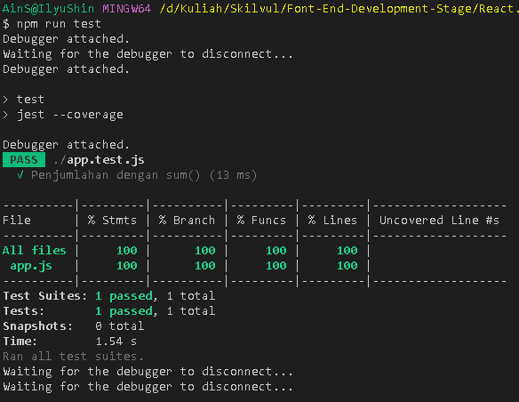

## RTL (React Testing Library)
